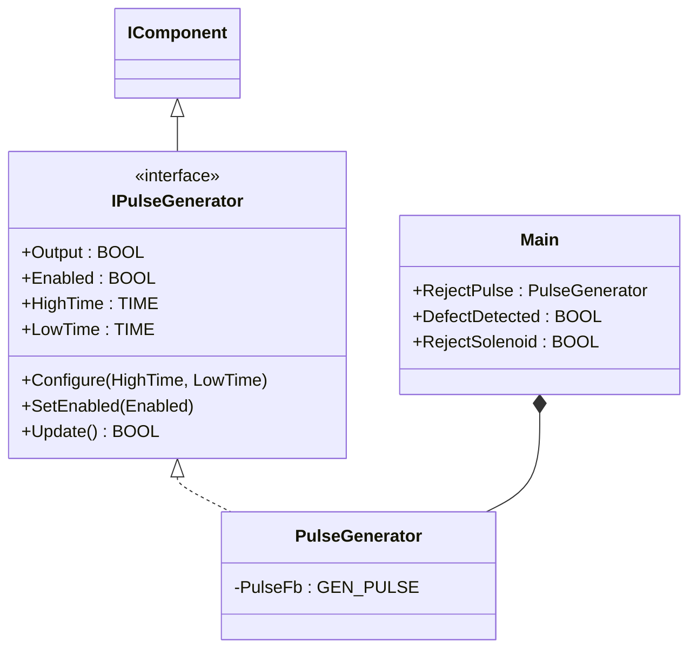
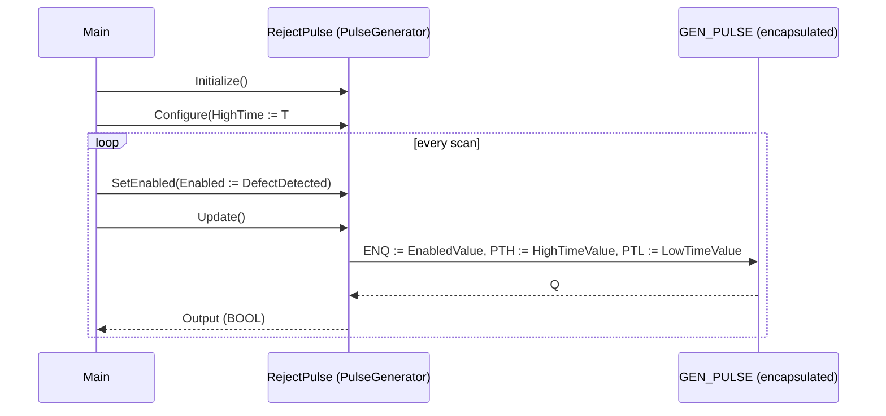

# Packaging Reject Pulse — Component Composition

A packaging line uses a vision check to find defective products and a
solenoid-driven gate to push them off the conveyor. The solenoid needs
a fixed-duration pulse when a defect is reported, with a minimum
recovery interval before it can fire again. The OOP version wraps the
classic `GEN_PULSE` timing FB inside `PulseGenerator`, separating "how
the timing is configured" (Configure once) from "what is the current
defect signal" (SetEnabled per scan) and "compute the output now"
(Update). This is a compact showcase that uses one OSCAT OOP component
without adding any custom function blocks.

## When classic is the right answer

The procedural version is `non-oop/src/Main.st` (10 lines). Use it when:

- The line has one reject station with one fixed pulse duration.
- Pulse timing is hard-coded in the program and never changes at
  runtime (no recipe-driven dwell time, no calibration mode).
- No second consumer reads the pulse state (no HMI, no historian, no
  reject-counter).
- Only one pulse generator instance is ever needed.

The OOP version costs about 1.4× the lines and earns its cost on the
first reuse — when a second reject station, a different actuator class
(blow-off, ink-jet marker), or a recipe-driven dwell time appears.
The classic `GEN_PULSE` is a single FB call with positional inputs;
the OOP wrapper splits configuration, enable signal, and output
computation into separate methods.

## Where classic strains

`non-oop/src/Main.st` (10 lines) calls `RejectPulse(ENQ :=
DefectDetected, PTH := T#150ms, PTL := T#500ms)` on every scan,
threading the timing literals as positional arguments. Adding a second
reject station means duplicating the call site with a fresh literal
pair. Adding a recipe-driven dwell (small bottles dwell 80ms, large
bottles dwell 150ms) means a `CASE OF Recipe` immediately around the
call site. Adding pulse-state telemetry means reading `RejectPulse.Q`
from a different scope, mixing producer and consumer in one block. By
the third station the program is mostly a transcribed schematic.

## Structure



`PulseGenerator`, `GEN_PULSE`, and the `IComponent` lifecycle contract
come from the OSCAT library. This example defines no FBs of its own;
the lesson is the configure/enable/update separation and how each
concern owns its method.

## What happens at runtime



## The keystone

```st
(* Configuration is set once; per-scan the inspection result toggles enable
   and Update() returns the current solenoid drive *)
RejectPulse.Initialize();
RejectPulse.Configure(HighTime := T#150ms, LowTime := T#500ms);
RejectPulse.SetEnabled(Enabled := DefectDetected);
RejectSolenoid := RejectPulse.Update();
```

Three separate methods replace the one positional call — Configure
owns the timing, SetEnabled owns the trigger, Update is a pure scan
step that returns the current Q. Recipe variants change the timing
without touching the inspection scan; inspection logic changes
SetEnabled without touching the timing.

## Patterns used

- [Composition (the underlying mechanism)](../../../docs/guides/oop-concepts-in-st.md#composition)

ST mechanics used:

- [Interface](../../../docs/guides/oop-concepts-in-st.md#interface) and
  [IMPLEMENTS](../../../docs/guides/oop-concepts-in-st.md#implements)
- [Composition](../../../docs/guides/oop-concepts-in-st.md#composition)
- [Properties](../../../docs/guides/oop-concepts-in-st.md#properties)

## What this demo doesn't show

- **Multiple reject stations.** This showcase has one solenoid. A
  multi-station line would instantiate one `PulseGenerator` per
  station with shared `Configure`.
- **Recipe-driven dwell.** Pulse times are local literals. A real
  packaging line loads them from a recipe table per product.
- **Reject counter.** The output is a boolean — there is no
  `DwordCounter` accumulating reject events for SCADA.
- **Operator override.** No "force-pulse for jam clearance" command;
  no manual SetEnabled from HMI.
- **Pulse-state telemetry.** `Output` and `Enabled` are computed but
  not routed to MQTT, OPC UA, or a historian.

## When NOT to use this

- One reject station with one fixed dwell — the classic `GEN_PULSE`
  call is shorter than the configure/enable/update split.
- An actuator that does not need a pulse (a continuous diverter that
  is just open/closed) — the wrapper buys nothing.
- A program where the reject signal is already a clean pulse from an
  upstream device; the timing wrapper is duplicate plumbing.

## Why this is a showcase

The compact showcase is intentionally minimal. There is no second
station, no recipe, no counter, no HMI. The defect signal is a local
boolean so the ST tests exercise the configure/enable/update sequence
without external sensors.

For composition combined with patterns inside a real-world plant, see
`pharma_filling_builder_state/oop` (Builder + State for recipe-driven
machines) or `boiler_room_heating_plant/oop` (full alarm-bus model).

## Run

```bash
trust-runtime test --project examples/OSCAT/packaging_reject_pulse/non-oop
trust-runtime test --project examples/OSCAT/packaging_reject_pulse/oop
```

---

## Folder Layout

This paired example contains:

- `non-oop/` — the classic Structured Text project.
- `oop/` — the OSCAT OOP Structured Text project.

## What This Example Teaches

OOP pattern: Component Composition (compact showcase). The OOP version
moves decisions behind named function-block instances and separates
configuration from per-scan input; the non-oop version inlines those
decisions in procedural ST.

## How The Pair Teaches OOP

The teaching content above walks through the same machine in both
projects: where classic strains, the structural diagram of the OOP
version, the keystone snippet, and the call sequence. Run the pair
side-by-side and read `non-oop/src/Main.st` first.
