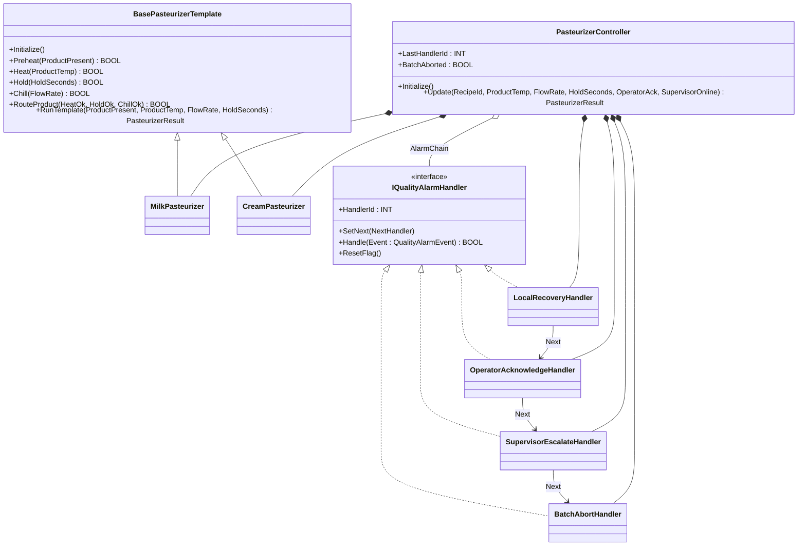

# Pasteurizer Quality Chain — Template Method + Chain of Responsibility

A milk/cream pasteurizer must heat product to a recipe-specific
temperature, hold for a recipe-specific dwell time, chill with a
minimum flow, and divert to recirculation when any step fails. When
quality fails, an alarm chain decides who handles it: local recovery
first, operator acknowledgement next, supervisor escalation, then a
batch abort. The OOP version runs each recipe through a `RunTemplate`
hook (`Heat → Hold → Chill → RouteProduct`) and routes alarms through
a chain of `IQualityAlarmHandler` objects.

## When classic is the right answer

The procedural version is `non-oop/src/Main.st` (84 lines). Use it when:

- One product (e.g. milk only) — no recipe variants to template.
- Single escalation policy fixed at the controller — no per-site
  reordering.
- Chain handlers' decisions are simple inequalities you can write
  inline.

The OOP version costs about 5× the lines. It earns that cost when the
recipe set grows (cream, ice-cream mix, juice all need different
temps/times) and when the escalation order or handler set changes
between sites.

## Where classic strains

`non-oop/src/Main.st` (84 lines) inlines per-recipe constants and a
4-arm `IF/ELSIF` quality-alarm ladder into the same `Update` body.
Adding a third recipe means duplicating the heat/hold/chill arithmetic
in every recipe arm. Adding a UV-recovery handler before operator-ack
means restructuring the whole IF/ELSIF order so the next-arm conditions
still make sense.

## Structure



`Pt2Filter` and `DwordCounter` come from the OSCAT OOP library. The
template base, two recipes, the quality-alarm interface, four
handlers, and `PasteurizerController` are defined in this example.

## What happens at runtime

```mermaid
sequenceDiagram
    participant Main
    participant C as PasteurizerController
    participant T as Recipe (Milk or Cream)
    participant Local as LocalRecoveryHandler
    participant Op as OperatorAcknowledgeHandler
    participant Sup as SupervisorEscalateHandler
    participant Abort as BatchAbortHandler

    Main->>C: Update(RecipeId, ProductTemp, FlowRate, HoldSeconds, OperatorAck, SupervisorOnline)
    C->>C: ResetFlag() on every handler
    alt RecipeId = 2
        C->>T: Cream.RunTemplate(...)
    else
        C->>T: Milk.RunTemplate(...)
    end
    T-->>C: PasteurizerResult (ForwardDivert, DivertToRecirc, ...)
    alt DivertToRecirc
        C->>Local: Handle(QualityAlarmEvent)
        alt within 1°C and flow ok
            Local-->>C: TRUE; chain stops
        else
            Local->>Op: Handle(...)
            alt OperatorAck
                Op-->>C: TRUE; chain stops
            else
                Op->>Sup: Handle(...)
                alt SupervisorOnline
                    Sup-->>C: TRUE; chain stops
                else
                    Sup->>Abort: Handle(...)
                    Abort-->>C: TRUE (always handles)
                end
            end
        end
    end
```

## The keystone

```st
(* Template method: classes plug Heat / Hold / Chill / RouteProduct hooks. *)
ELSIF NOT Heat(ProductTemp := ProductTemp) THEN
    LastResult.SequenceStep := INT#20;
    LastResult.ForwardDivert := FALSE;
ELSE
    HeatOk := TRUE;
    HoldOk := Hold(HoldSeconds := HoldSeconds);
    ChillOk := Chill(FlowRate := FlowRate);
    LastResult.ForwardDivert := RouteProduct(HeatOk := HeatOk,
                                             HoldOk := HoldOk,
                                             ChillOk := ChillOk);
END_IF;
LastResult.DivertToRecirc := NOT LastResult.ForwardDivert;

(* Chain of responsibility: clear sticky flags, then dispatch *)
LastHandlerIdValue := INT#0;
Local.ResetFlag();  Operator.ResetFlag();
Supervisor.ResetFlag();  Abort.ResetFlag();
IF LastResultValue.DivertToRecirc THEN
    AlarmChain.Handle(Event := Event);
    IF Abort.Aborted THEN LastHandlerIdValue := Abort.HandlerId;
    ELSIF Supervisor.Escalated THEN LastHandlerIdValue := Supervisor.HandlerId;
    ELSIF Operator.Acknowledged THEN LastHandlerIdValue := Operator.HandlerId;
    ELSIF Local.Recovered THEN LastHandlerIdValue := Local.HandlerId; END_IF;
END_IF;
```

A new recipe is `FUNCTION_BLOCK NewRecipe EXTENDS BasePasteurizerTemplate`
overriding `RequiredTemperature` / `RequiredHoldSeconds`. A new handler
slots into the chain by changing one `SetNext` wiring statement —
handler bodies are untouched.

## Patterns used

- [Template Method](../../../docs/guides/oop-concepts-in-st.md#template-method)
- [Chain of Responsibility](../../../docs/guides/oop-concepts-in-st.md#chain-of-responsibility)

ST mechanics used:

- [Interface](../../../docs/guides/oop-concepts-in-st.md#interface) and
  [IMPLEMENTS](../../../docs/guides/oop-concepts-in-st.md#implements)
- [Inheritance](../../../docs/guides/oop-concepts-in-st.md#inheritance)
  (recipes EXTENDS the template base)
- [Polymorphism](../../../docs/guides/oop-concepts-in-st.md#polymorphism)
- [Composition](../../../docs/guides/oop-concepts-in-st.md#composition)

## What this demo doesn't show

- **Hold-timer integration.** `Hold(HoldSeconds)` takes the elapsed
  time as a parameter; production wires this to a real timer FB.
- **Cream's hold time differs.** `RequiredHoldSeconds` returns 15 s
  for milk and 20 s for cream — production wires the recipe-aware
  timer to drive this.
- **Per-batch audit trail.** `LastHandlerId` records only the most
  recent handler. For a per-batch ledger see
  `chemical_dosing_command/oop` (Command + audit FIFO).
- **Mid-batch handler reordering.** Chain order is hard-coded in
  `Initialize`. A site that needs different escalation per shift would
  read `Configuration.st` and rewire on startup.

## When NOT to use this

- One product, one quality threshold — `IF Quality < Limit THEN
  Reject` in the controller is shorter than the chain.
- Two handlers in fixed order — write the IF/ELSE inline.
- Escalation depends on cross-cutting plant state rather than the
  per-batch event — consider Mediator instead.

## Integration map

| Tag | Address | Direction |
| --- | --- | --- |
| `Pasteurizer.RecipeId` | `%IW0` | IN |
| `Pasteurizer.ProductTempRaw` | `%IW2` | IN |
| `Pasteurizer.FlowRateRaw` | `%IW4` | IN |
| `Pasteurizer.OperatorAck` | `%IX0.0` | IN |
| `Pasteurizer.SupervisorOnline` | `%IX0.1` | IN |
| `Pasteurizer.ForwardValveOut` | `%QX0.0` | OUT |
| `Pasteurizer.DivertValveOut` | `%QX0.1` | OUT |
| `Pasteurizer.AlarmOut` | `%QX0.2` | OUT |

Comms (from `oop/io.toml`): `modbus-tcp` for recipe id and operator
ack; `mqtt` for batch quality events to the historian.

OPC UA exposed records (from `oop/runtime.toml`):
`Pasteurizer.LastHandlerId`, `Pasteurizer.BatchAborted`,
`Pasteurizer.RequiredTemperature`, `Pasteurizer.ForwardDivert`.

## Run

```bash
trust-runtime test --project examples/OSCAT/pasteurizer_quality_chain/non-oop
trust-runtime test --project examples/OSCAT/pasteurizer_quality_chain/oop
```

---

## Folder Layout

This paired example contains:

- `non-oop/` — the classic Structured Text project.
- `oop/` — the OSCAT OOP Structured Text project.

## What This Example Teaches

OOP pattern: Template Method + Chain of Responsibility. The OOP
version moves decisions behind named function-block instances and an
interface contract; the non-oop version inlines those decisions in
procedural ST.

## How The Pair Teaches OOP

The teaching content above walks through the same machine in both
projects: where classic strains, the structural diagram of the OOP
version, the keystone snippet, and the integration map. Run the pair
side-by-side and read `non-oop/src/Main.st` first.
