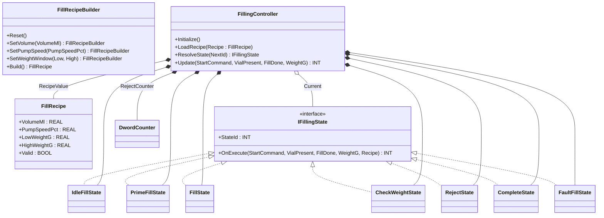
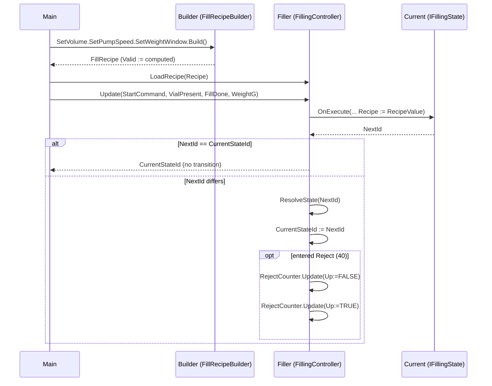

# Pharma Filling — Builder + State

A sterile vial filler runs four steps per vial — Prime, Fill, Check
Weight, Reject or Complete — gated by a recipe that defines volume,
pump speed, and tolerance window. The recipe must be validated before
the pump can start (a vial is too expensive to fill twice). The OOP
version pairs two patterns: `Builder` constructs and validates the
`FillRecipe` before it reaches the controller, and `State` puts each
sequence step behind `IFillingState` so the central `FillingController`
owns transition mechanics, not step-specific decisions.

## When classic is the right answer

The procedural version is `non-oop/src/Main.st` (71 lines). Use it when:

- The line fills one product family with one fixed recipe.
- Recipe validation is informal — a hand-tuned PLC where the operator
  is trusted to set good values.
- The sequence has not changed in years (no soaks, no double-prime,
  no integrity-check step coming).
- Reject classification is one boolean (good / bad) with no per-step
  exception handling.

The OOP version costs about 5× the lines. It earns that cost when
recipes need validation before the pump starts (one bad recipe equals
one ruined batch), and when sequence steps evolve during commissioning
(e.g., adding a stopper-presence check after CheckWeight, or splitting
Reject into "weight-low" and "weight-high" branches that flag the
operator differently).

## Where classic strains

`ClassicFillingController.Update` (lines 25-54 of `non-oop/src/Main.st`)
is one `CASE OF CurrentStateValue` that covers Idle, Prime, Fill, and
CheckWeight inline. Adding a fifth state (e.g., `IntegrityCheck` after
CheckWeight) means renumbering, editing every CASE arm that transitions
to those numbers, and re-checking the transition arrows. Recipe
validation is one method that returns BOOL — but a half-built recipe
(volume set, weight window not set) silently produces nonsense in the
caller. Adding a per-step abort condition ("only Fill can be aborted
mid-cycle; CheckWeight must complete") means yet another flag tested
at the top of every CASE arm. By the third recipe revision the CASE
is the most-edited block in the project.

## Structure



`DwordCounter` comes from the OSCAT OOP library. `FillRecipeBuilder`,
`FillRecipe`, the `IFillingState` interface, the seven state FBs, and
`FillingController` are defined in this example.

State id numbering: `0=Idle, 10=Prime, 20=Fill, 30=CheckWeight,
40=Reject, 90=Fault, 100=Complete`. Numbering is gapped so an
`IntegrityCheck` step can be inserted at `35` without renumbering.

## What happens at runtime



## The keystone

```st
(* Builder: a fluent chain that returns a validated record *)
Recipe := Builder
    .SetVolume(VolumeMl := REAL#10.0)
    .SetPumpSpeed(PumpSpeedPct := REAL#45.0)
    .SetWeightWindow(LowWeightG := REAL#9.8, HighWeightG := REAL#10.2)
    .Build();
(* State: each step decides its own next id; controller owns the dispatch *)
NextId := Current.OnExecute(StartCommand := StartCommand, ...,
    Recipe := RecipeValue);
IF NextId <> CurrentStateIdValue THEN
    Current := ResolveState(NextId := NextId);
    CurrentStateIdValue := NextId;
END_IF;
```

The Builder validates the recipe in `Build`: volume must be in
`(0, 100]` ml, pump speed in `(0, 100]` percent, and `HighWeightG >
LowWeightG`. A half-built recipe arrives at the filler with `Valid :=
FALSE`, and `IdleFillState.OnExecute` refuses to leave Idle until the
recipe is valid. Reject and Complete are restart-friendly: a fresh
`StartCommand + VialPresent` advances directly to Prime so the next
vial does not lose its start pulse waiting in Idle.

## Patterns used

- [Builder](../../../docs/guides/oop-concepts-in-st.md#builder)
- [State](../../../docs/guides/oop-concepts-in-st.md#state)

ST mechanics used:

- [Interface](../../../docs/guides/oop-concepts-in-st.md#interface) and
  [IMPLEMENTS](../../../docs/guides/oop-concepts-in-st.md#implements)
- [Polymorphism](../../../docs/guides/oop-concepts-in-st.md#polymorphism)
- [Composition](../../../docs/guides/oop-concepts-in-st.md#composition)
- [Method chaining](../../../docs/guides/oop-concepts-in-st.md#method-chaining)
  (returning `THIS`)

## What this demo doesn't show

- **Per-state entry/exit actions.** State FBs return the next id but
  do not own actuator drives. `PumpRunOut` and `RejectOut` are derived
  from `CurrentStateId` in `Main`; a real filler would let each state
  own a `PumpEnable : BOOL` property and read it polymorphically.
- **Multi-class reject reasons.** `RejectState` is one terminal step;
  there is no separation of weight-low, weight-high, vial-broken, or
  pump-fault.
- **Stopper / cap check.** A real sterile filler has integrity steps
  (vial integrity, stopper present, cap torque). The demo only
  validates fill weight.
- **Recipe persistence.** Recipes are local literals in `Main`; a real
  plant loads them from a recipe table or from MES.
- **Batch / lot tracking.** `RejectCount` is a single accumulator;
  there is no per-lot reset or per-shift summary.

## When NOT to use this

- A line that fills one fixed product with one hard-tuned recipe — the
  Builder and the per-state FBs are overhead.
- A sequence of three or four steps that has not changed in years —
  the procedural CASE is shorter.
- A controller whose transitions all look the same ("step complete →
  next") with no per-state entry actions or per-step abort rules.

## Integration map

| Tag | Address | Direction |
| --- | --- | --- |
| `Filler.StartCommand` | `%IX0.0` | IN |
| `Filler.VialPresent` | `%IX0.1` | IN |
| `Filler.FillDone` | `%IX0.2` | IN |
| `Filler.WeightRaw` | `%IW0` | IN |
| `Filler.PumpRunOut` | `%QX0.0` | OUT |
| `Filler.RejectOut` | `%QX0.1` | OUT |

Comms (from `oop/io.toml`): `modbus-tcp` (slave 80 on
`127.0.0.1:1506`, `timeout_ms = 500`), `mqtt` (broker
`127.0.0.1:1883`, topics `pharma/filler/01/cmd` in,
`pharma/filler/01/batch_report` out). Safe-state forces
`Filler.PumpRunOut := FALSE` on driver fault.

OPC UA exposed records (from `oop/runtime.toml`, namespace
`urn:trust:examples:pharma-filling-builder-state`):
`Filler.CurrentStateId`, `Filler.RejectCount`, `Filler.RecipeValid`.

## Run

```bash
trust-runtime test --project examples/OSCAT/pharma_filling_builder_state/non-oop
trust-runtime test --project examples/OSCAT/pharma_filling_builder_state/oop
```

---

## Folder Layout

This paired example contains:

- `non-oop/` — the classic Structured Text project.
- `oop/` — the OSCAT OOP Structured Text project.

## What This Example Teaches

OOP pattern: Builder + State. The OOP version moves decisions behind
named function-block instances and an interface contract; the non-oop
version inlines those decisions in procedural ST.

## How The Pair Teaches OOP

The teaching content above walks through the same machine in both
projects: where classic strains, the structural diagram of the OOP
version, the keystone snippet, and the integration map. Run the pair
side-by-side and read `non-oop/src/Main.st` first.
