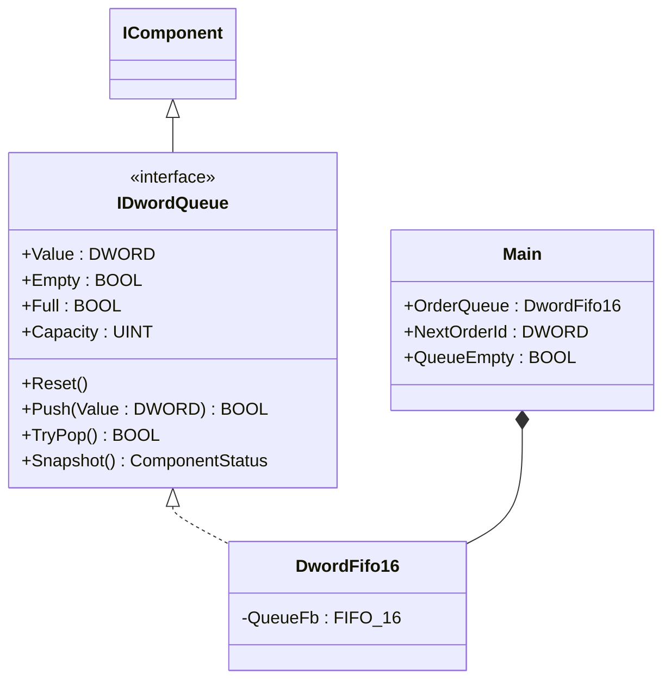
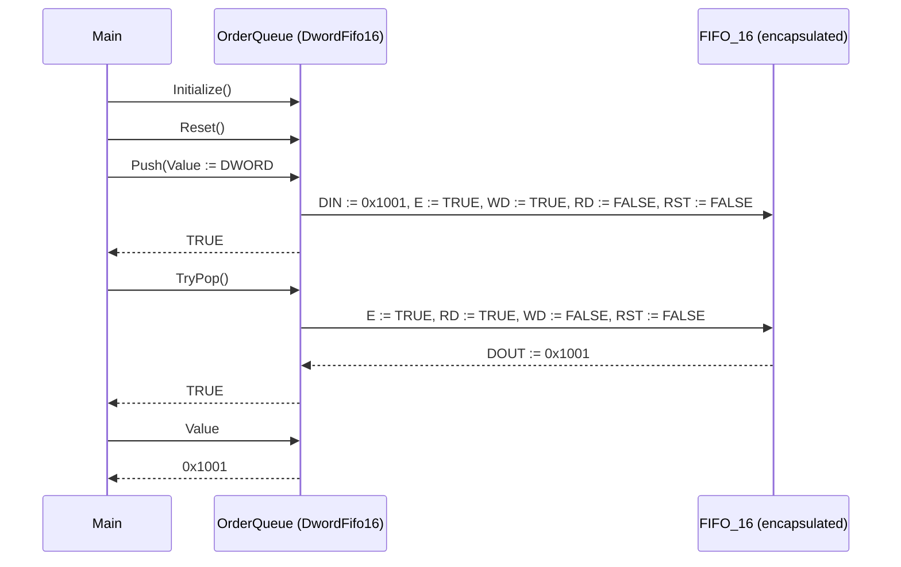

# Production Queue — Component Composition

A small assembly cell hands work-orders from an upstream order
generator (MES, scheduler, or operator panel) to a downstream worker
station. The handoff needs FIFO semantics, an explicit empty signal,
and a way to refuse writes when the buffer is full. The OOP version
wraps the OSCAT `FIFO_16` block inside `DwordFifo16`, splitting the
classic four-pin operation (`E`, `RD`, `WD`, `RST`, `DIN`) into named
methods (`Push`, `TryPop`, `Reset`) with explicit return values that
report success/failure.

## When classic is the right answer

The procedural version is `non-oop/src/Main.st` (12 lines). Use it when:

- The plant has one queue between two co-located stations.
- The producer never overruns the buffer (system is rate-limited
  upstream so `WD := TRUE` always succeeds).
- No second consumer reads the buffer state (no HMI showing depth, no
  historian recording overflow events).
- The pulse-style FIFO call is a known idiom in the existing codebase.

The OOP version costs about 1.5× the lines and earns its cost on the
first reuse — when a second queue with different consumer/producer
rates appears, when overflow events become an alarmable condition, or
when the test surface needs to assert on Push and TryPop returning
booleans rather than reading positional FB outputs.

## Where classic strains

`non-oop/src/Main.st` (12 lines) calls `OrderQueue(DIN := ..., E :=
TRUE, RD := FALSE, WD := TRUE, RST := FALSE)` to push, then a second
call with `RD := TRUE, WD := FALSE` to pop. The pulse semantics are
implicit in the four boolean inputs. Forgetting to reset `WD` before
the next push causes the FB to interpret a steady write as one write
and one no-op. The classic FB returns no boolean to say "full" or "I
refused"; the caller has to read `OrderQueue.FULL` after the call. By
the second queue the producer logic is mostly bookkeeping the four
pulse inputs across scans.

## Structure



`DwordFifo16` and the `IComponent`/`IDwordQueue` lifecycle contract
come from the OSCAT library. This example defines no FBs of its own;
the lesson is the call sequence and how the wrapper turns pulse pins
into method calls with explicit return values.

## What happens at runtime



## The keystone

```st
(* Push and pop return booleans; the caller is forced to handle the
   "I refused" case explicitly *)
IF OrderQueue.Push(Value := DWORD#16#1001) THEN
    IF OrderQueue.TryPop() THEN
        NextOrderId := OrderQueue.Value;
    END_IF;
END_IF;
QueueEmpty := OrderQueue.Empty;
QueueStatus := OrderQueue.Snapshot();
QueueHealthy := QueueStatus.Ready AND NOT QueueStatus.Error;
```

`Push` returns FALSE when the queue is full and raises
`ComponentErrorQueueFull` in the snapshot. `TryPop` returns FALSE when
the queue is empty (instead of returning a stale `DOUT`). The classic
version cannot tell "I read the same DOUT twice because RD was
inactive" apart from "I read a real value" without auxiliary
bookkeeping.

## Patterns used

- [Composition (the underlying mechanism)](../../../docs/guides/oop-concepts-in-st.md#composition)

ST mechanics used:

- [Interface](../../../docs/guides/oop-concepts-in-st.md#interface) and
  [IMPLEMENTS](../../../docs/guides/oop-concepts-in-st.md#implements)
- [Composition](../../../docs/guides/oop-concepts-in-st.md#composition)
- [Properties](../../../docs/guides/oop-concepts-in-st.md#properties)

## What this demo doesn't show

- **Multiple queues.** This showcase has one buffer. A multi-station
  cell would instantiate one `DwordFifo16` per upstream/downstream
  pair.
- **Order metadata.** Only an order ID is queued. A real plant pairs
  IDs with a side-table holding product class, target time,
  operator, etc.
- **Overflow alarming.** `Push` returns FALSE on overflow; nothing is
  routed to an alarm bus or counter — a real cell would log overflow
  events and raise an HMI banner.
- **Larger capacities.** `DwordFifo16` is fixed at capacity 16. A real
  buffer might use `DwordFifo64` or backing storage in retentive
  memory.
- **Inter-scan handoff timing.** Producer and consumer run in the same
  scan in the demo; a real plant has independent task rates that
  exercise full/empty edge cases.

## When NOT to use this

- One immediate handoff between two co-located steps in the same
  scan — direct variables are shorter than push/pop.
- A buffer where overflow is physically impossible (single-item
  flag) — the queue is overkill.
- A program where the existing FB-call idiom is the team's standard
  and tests already exercise the pulse semantics.

## Why this is a showcase

The compact showcase is intentionally minimal. There is no producer
or consumer scheduler, no metadata table, no alarm sink. Order IDs
are local literals so the ST tests exercise the FIFO semantics
without external sources or sinks.

For composition combined with patterns inside a real-world plant, see
`boiler_room_heating_plant/oop` (full alarm-bus model with classes
A/B/C and per-subscriber sinks) or `cold_storage_plant/oop`
(multi-room composite tree).

## Run

```bash
trust-runtime test --project examples/OSCAT/production_queue/non-oop
trust-runtime test --project examples/OSCAT/production_queue/oop
```

---

## Folder Layout

This paired example contains:

- `non-oop/` — the classic Structured Text project.
- `oop/` — the OSCAT OOP Structured Text project.

## What This Example Teaches

OOP pattern: Component Composition (compact showcase). The OOP version
moves decisions behind named function-block instances and explicit
boolean return values; the non-oop version inlines those decisions in
procedural ST with pulse-style positional inputs.

## How The Pair Teaches OOP

The teaching content above walks through the same machine in both
projects: where classic strains, the structural diagram of the OOP
version, the keystone snippet, and the call sequence. Run the pair
side-by-side and read `non-oop/src/Main.st` first.
