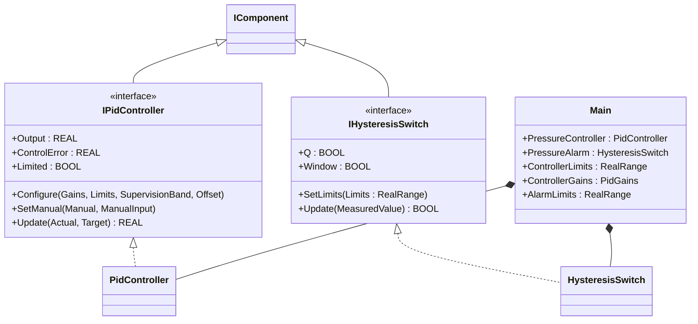
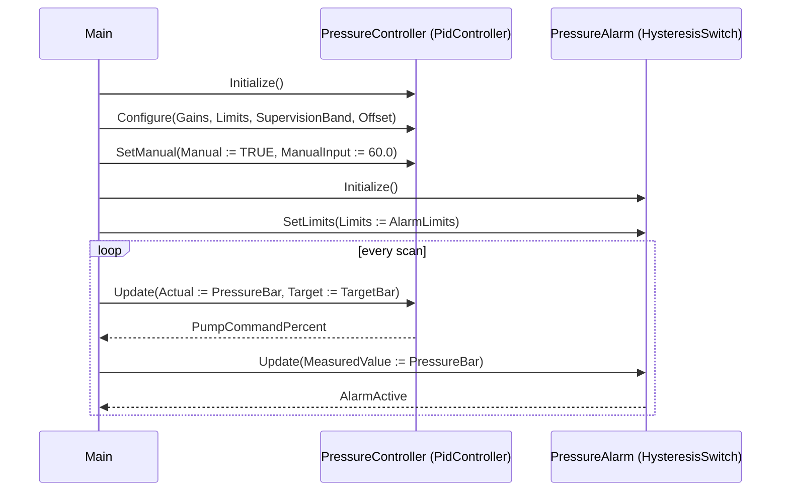

# Pump Pressure — Component Composition

A booster pump on a process water line modulates pump speed to hold a
target pressure, while a separate alarm watches the same pressure
sensor and trips when the value leaves a configured deadband. The OOP
version composes two OSCAT components — `PidController` for the
modulation loop and `HysteresisSwitch` for the alarm — each
configured with its own `RealRange`, `PidGains`, and lifecycle. The
two share an input but no hidden state.

## When classic is the right answer

The procedural version is `non-oop/src/Main.st` (28 lines). Use it when:

- The pump is one fixed loop with one fixed gain set, one fixed
  output range, and one fixed alarm band.
- Manual / auto handover is informal (operator sets `MAN := TRUE`
  directly in code; never via a separate UI command).
- Configuration is hard-coded in `Main` and never re-applied at
  runtime.
- No second consumer reads the loop's intermediate values
  (`ControlError`, `Limited`, `Output`) — there is no telemetry, no
  HMI faceplate, no historian.

The OOP version costs about 1.3× the lines and earns its cost when the
loop config evolves (gain change, output range change, supervision
band) and when the test surface needs to assert on each intermediate
property — `Output`, `ControlError`, `Limited`, `Manual`,
`ManualInput` — independent of the FB internals.

## Where classic strains

`non-oop/src/Main.st` (28 lines) calls `CTRL_PID(...)` with twelve
positional inputs (`ACT`, `SET_POINT`, `SUP`, `OFS`, `M_I`, `MAN`,
`RST`, `KP`, `TN`, `TV`, `LL`, `LH`) on every scan. The pattern
forces the caller to repeat all twelve on every loop iteration even
though only `ACT` and `SET_POINT` change. Adding a second pump means
duplicating the twelve-input call site. Adding manual/auto handover
means a separate variable for `MAN` and `M_I` that the operator
flips. Validating the limits (`LL <= LH`) becomes the caller's
responsibility — there is no error path. By the second pump or the
first faceplate the call site is mostly an argument list.

## Structure



`PidController`, `HysteresisSwitch`, `PidGains`, `RealRange`, and the
`IComponent` lifecycle contract come from the OSCAT library. This
example defines no FBs of its own; the lesson is composition — two
components share one input but keep separate state and configuration.

## What happens at runtime



## The keystone

```st
(* Each component is configured separately and updated independently *)
PressureController.Configure(
    Gains := ControllerGains,
    Limits := ControllerLimits,
    SupervisionBand := REAL#0.0,
    Offset := REAL#0.0
);
PressureController.SetManual(Manual := TRUE, ManualInput := REAL#60.0);
PressureAlarm.SetLimits(Limits := AlarmLimits);
PumpCommandPercent := PressureController.Update(Actual := PressureBar, Target := TargetBar);
AlarmActive := PressureAlarm.Update(MeasuredValue := PressureBar);
```

Three configuration calls (`Configure`, `SetManual`, `SetLimits`) and
two update calls. Each component keeps its own state — `Manual`,
`ManualInput`, `Output`, `ControlError`, `Limited` belong to the PID;
`Q`, `Window`, `LowLimit`, `HighLimit` belong to the alarm. Adding a
second pump is one new pair of components; adding HMI manual override
is one `SetManual` call from the operator-command scope.

## Patterns used

- [Composition (the underlying mechanism)](../../../docs/guides/oop-concepts-in-st.md#composition)

ST mechanics used:

- [Interface](../../../docs/guides/oop-concepts-in-st.md#interface) and
  [IMPLEMENTS](../../../docs/guides/oop-concepts-in-st.md#implements)
- [Composition](../../../docs/guides/oop-concepts-in-st.md#composition)
- [Properties](../../../docs/guides/oop-concepts-in-st.md#properties)

## What this demo doesn't show

- **Auto / manual handover.** The demo holds the controller in manual
  mode (`Manual := TRUE`, `ManualInput := 60.0`) so the test gets a
  deterministic output. A real pump would expose a faceplate with
  bumpless transfer between modes.
- **Multiple pumps.** This showcase has one loop. A real station has
  duty/standby pumps, sequenced starts, and runtime equalization (see
  the OSCAT `OntimeMeter` for the runtime hours).
- **Supervisory deadband.** `SupervisionBand` is configured to zero;
  the demo does not exercise the controller's "in-window" status.
- **Alarm fan-out.** The alarm is a single boolean — no FIFO, no
  acknowledgement, no class A/B/C separation. For a complete
  alarm-bus model see `boiler_room_heating_plant/oop`.
- **Sensor conditioning.** The pressure value is a local literal. A
  real installation feeds it through a `Pt1Filter` or
  `MovingAverage` to reject noise.

## When NOT to use this

- An on/off pressure switch (no modulation, no PID) — the classic
  `HYST` alone is shorter than the configure/update split.
- A loop where every config field is hard-coded and never changes —
  the classic positional FB call is one line, the OOP version is
  three.
- A program where the alarm and the controller share a non-trivial
  state machine (e.g., interlock that disables the controller while
  the alarm is active) — the demo's clean separation does not model
  that interlock.

## Why this is a showcase

The compact showcase is intentionally minimal. There is no second
pump, no auto/manual handover, no alarm bus, no telemetry. Pressure
values are local literals so the ST tests exercise the
composition — two components reading one input but each owning its
own state — without external sensors.

For composition combined with patterns inside a real-world plant, see
`boiler_room_heating_plant/oop` (full alarm-bus model with classes
A/B/C and per-subscriber sinks) or `cold_storage_plant/oop`
(multi-room composite tree with maintenance + MQTT subscribers).

## Run

```bash
trust-runtime test --project examples/OSCAT/pump_pressure/non-oop
trust-runtime test --project examples/OSCAT/pump_pressure/oop
```

---

## Folder Layout

This paired example contains:

- `non-oop/` — the classic Structured Text project.
- `oop/` — the OSCAT OOP Structured Text project.

## What This Example Teaches

OOP pattern: Component Composition (compact showcase). The OOP version
moves decisions behind named function-block instances and explicit
configure/update separation; the non-oop version inlines those
decisions in procedural ST with twelve-input positional calls.

## How The Pair Teaches OOP

The teaching content above walks through the same machine in both
projects: where classic strains, the structural diagram of the OOP
version, the keystone snippet, and the call sequence. Run the pair
side-by-side and read `non-oop/src/Main.st` first.
