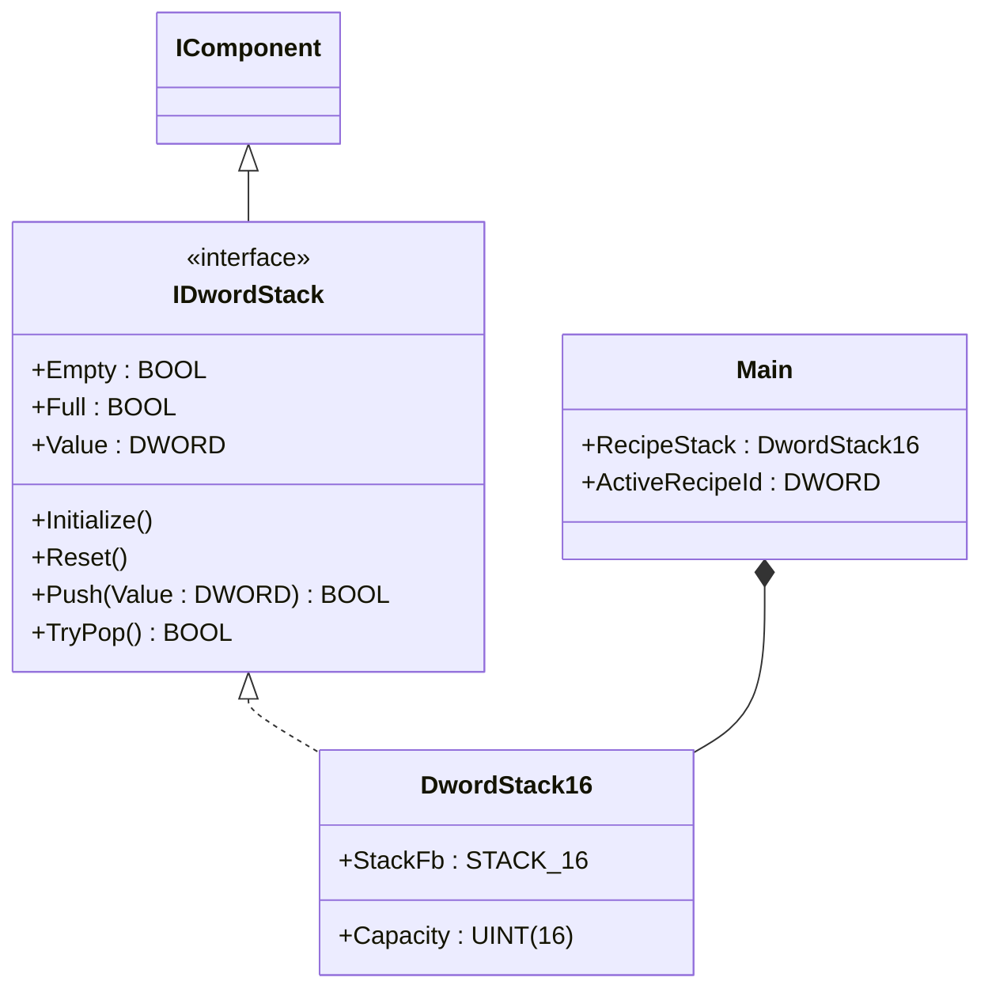
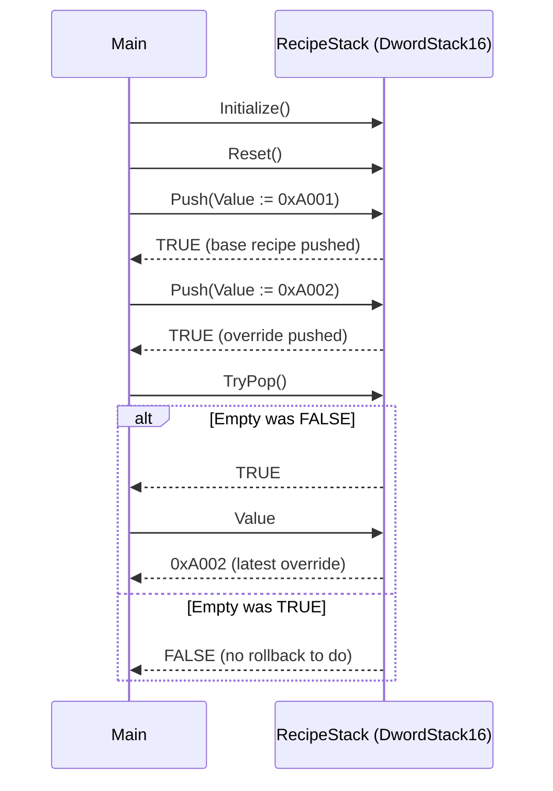

# Recipe Batch Stack — Composition

A batch cell where operators push temporary recipe overrides (a special-run
variant, an emergency revision) and roll back when the override completes.
The behaviour is naturally LIFO — the newest override must be undone first
to return to whatever recipe was running underneath. This compact showcase
wires `DwordStack16` from the OSCAT OOP library directly inside `Main` so
the call sequence the ST tests verify is the whole program.

## When classic is the right answer

The procedural version is `non-oop/src/Main.st` (11 lines). Use it when:

- The cell runs one fixed recipe with no operator overrides.
- Overrides exist but only one nesting level (no override on top of an
  override).
- The stack plumbing is never reused on another tag (no second stack of
  campaign IDs, no separate stack of tool revisions).

The OOP version uses `DwordStack16` without adding custom function blocks of
its own. It earns its cost on the first reuse — when a second tag (campaign
IDs, tool revisions, batch revision tickets) needs the same push/pop
behaviour, you instantiate two named components instead of duplicating the
underlying `STACK_16` raw call sequence.

## Where classic strains

`non-oop/src/Main.st` (11 lines) drives the raw `STACK_16` FB through the
OSCAT pulse contract: every call passes `DIN`, `E`, `RD`, `WD`, `RST` even
when only one of them matters. The reader has to know that `WD := TRUE`
means "write the value", that `RD := TRUE` means "pop", that you must keep
`E := TRUE` between calls or the whole stack is disabled, and that the
output `DOUT` only carries the popped value when `RD := TRUE`. Adding a
second stack means duplicating this whole call protocol; adding a guard for
"don't push if full" means reading `RecipeStack.FULL` between every push.
By the second usage the procedural call sites read more like a transcribed
schematic than reusable component code.

## Structure



`DwordStack16` and the `IDwordStack` interface come from the OSCAT OOP
library. `STACK_16` is the underlying raw OSCAT function block; the OOP
wrapper hides the pulse-and-enable protocol behind named methods. This
example defines no FBs of its own — it shows the call sequence and how the
component integrates.

## What happens at runtime



## The keystone

```st
(* Push override on top, roll back to it on completion. *)
RecipeStack.Initialize();
RecipeStack.Reset();
IF RecipeStack.Push(Value := DWORD#16#A001) THEN
END_IF;
IF RecipeStack.Push(Value := DWORD#16#A002) THEN
END_IF;
IF RecipeStack.TryPop() THEN
    ActiveRecipeId := RecipeStack.Value;
END_IF;
```

`Push` returns FALSE on overflow (capacity 16); `TryPop` returns FALSE on
underflow. Both are safe to call unconditionally — the component owns the
guard. The raw `STACK_16` pulse contract (`DIN`, `E`, `RD`, `WD`, `RST`)
disappears behind two named methods.

## Patterns used

- [Composition (the underlying mechanism)](../../../docs/guides/oop-concepts-in-st.md#composition)

ST mechanics used:

- [Interface](../../../docs/guides/oop-concepts-in-st.md#interface) and
  [IMPLEMENTS](../../../docs/guides/oop-concepts-in-st.md#implements)
- [Composition](../../../docs/guides/oop-concepts-in-st.md#composition)

## What this demo doesn't show

- **Capacity-full handling.** `Push` returns FALSE on overflow but `Main`
  uses `IF ... THEN END_IF` and discards the result. A real recipe stack
  would log the overflow or refuse the override.
- **Underflow as a UI signal.** `TryPop` on an empty stack returns FALSE;
  `Main` simply skips the assignment. A real HMI would surface "no
  override to roll back" to the operator.
- **Recipe library lookup.** The pushed `DWORD` values are bare codes
  (`0xA001`, `0xA002`). A real plant would pair the code with a recipe
  parameter set fetched from a recipe database.
- **Multi-stack composition.** One stack of recipe overrides is the whole
  program. A real cell often pairs a recipe stack with a campaign queue
  (FIFO) and a fault stack (LIFO). The same `DwordStack16` and
  `DwordFifo16` would compose cleanly.

## When NOT to use this

- One-recipe cell that has run the same recipe for years — a `DWORD`
  variable is shorter than two FBs.
- Override behaviour that is FIFO, not LIFO (oldest must execute first):
  use `DwordFifo16` instead.
- Plant that already has a recipe-management library you must use; bringing
  in `DwordStack16` would duplicate plumbing.

## Why this is a showcase

The compact showcase is intentionally minimal. There is no recipe
database, no operator override prompt, no campaign queue, no MQTT recipe
bus, no historian. Process values are local literals so the ST tests
exercise the LIFO behaviour without external devices.

For composition combined with real I/O and a control loop see
`hvac_air_handling_unit/oop` (Strategy with telemetry, alarms, and Modbus
integration); for stacks composed with state machines and queues inside a
larger plant see `boiler_room_heating_plant/oop`.

## Run

```bash
trust-runtime test --project examples/OSCAT/recipe_batch_stack/non-oop
trust-runtime test --project examples/OSCAT/recipe_batch_stack/oop
```

---

## Folder Layout

This paired example contains:

- `non-oop/` — the classic Structured Text project.
- `oop/` — the OSCAT OOP Structured Text project.

## What This Example Teaches

OOP pattern: Composition (compact showcase). The OOP version moves the
pulse-and-enable protocol behind a named component object with a tidy
public surface; the non-oop version inlines the raw `STACK_16` calls in
procedural ST.

## How The Pair Teaches OOP

The teaching content above walks through the same machine in both
projects: where classic strains, the structural diagram of the OOP
version, the keystone snippet, and the call sequence. Run the pair
side-by-side and read `non-oop/src/Main.st` first.
