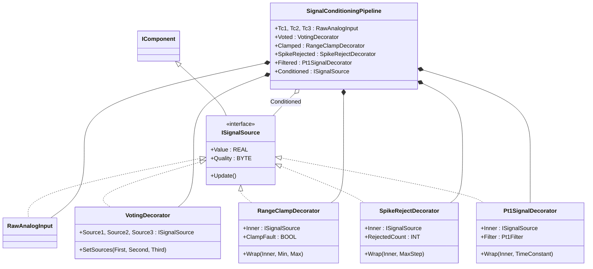
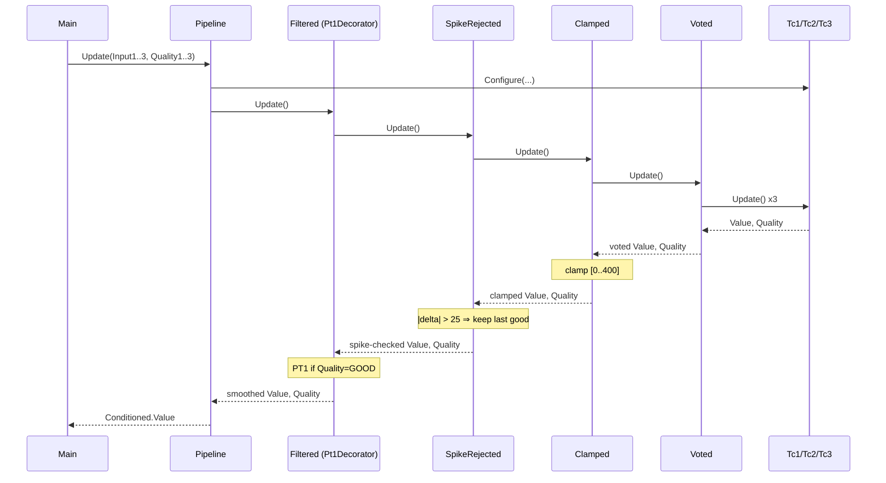

# Refinery Temperature Conditioning — Decorator

A distillation column overhead has three redundant thermocouples. The raw
readings need to be turned into one trustworthy temperature for the PID,
the alarm block, the historian, and the SCADA mirror. The pipeline votes
the redundant transmitters into one value, clamps to the engineering range
(0–400 °C), rejects single-scan spikes (anything stepping more than 25 °C
in one cycle), and finally smooths the accepted samples with a `Pt1Filter`.
The OOP version stacks each stage as a `Decorator` over the same
`ISignalSource` interface so the order is wiring, not algorithm.

## When classic is the right answer

The procedural version is `non-oop/src/Main.st` (113 lines). Use it when:

- One trusted analog input — no voting needed.
- One downstream consumer (just the PID); no historian, no MQTT, no OPC UA
  duplicate of the same conditioned value.
- Conditioning stages are fixed for the life of the unit (no plan to add a
  second damping profile for a slow historian).

The OOP version costs ~5× the lines. It earns that cost the moment a
second consumer needs the conditioned value, or a stage has to be inserted
or reordered, or the same conditioning chain has to be reused on a second
column.

## Where classic strains

`ClassicTemperatureConditioning.Update` (lines 23-79 of
`non-oop/src/Main.st`) is one straight-line method that runs vote → clamp →
spike-reject → filter inline. Each step uses local intermediates
(`VotedValue`, `VotedQuality`, `ClampedValue`, `ClampedQuality`) that the
next step reads. Adding a deglitch step between vote and clamp means
adding two more local variables and shifting the references in the clamp
arm. Adding a slow-historian damping profile means a second copy of the
filter logic with a different time constant, embedded in the same method.
Reordering (clamp before vote) means rewriting the whole method body.
Worse: every consumer that imports this conditioning logic gets the same
fixed stack — there is no way for the alarm block to skip the filter and
read the spike-rejected value directly.

## Structure



`Pt1Filter` and the `IComponent` contract come from the OSCAT OOP library.
The decorators and `SignalConditioningPipeline` are defined in this
example.

## What happens at runtime



## The keystone

```st
(* Each decorator delegates Update() to its Inner before applying its
   own rule. The chain is built once at Initialize. *)
METHOD PUBLIC Update
Inner.Update();
IF Inner.Quality <> BYTE#2 THEN
    ValueValue := Inner.Value;
    QualityValue := Inner.Quality;
ELSIF HasLastGood AND (ABS(Inner.Value - LastGoodValue) > MaxStepValue) THEN
    ValueValue := LastGoodValue;
    QualityValue := BYTE#1;
    RejectedCountValue := RejectedCountValue + INT#1;
ELSE
    ValueValue := Inner.Value;
    QualityValue := BYTE#2;
    LastGoodValue := Inner.Value;
    HasLastGood := TRUE;
END_IF;
END_METHOD
```

Adding a deglitch decorator is a new FB implementing `ISignalSource` plus
one line in the pipeline initializer. Adding a second damping chain for a
slow historian means a second `Pt1SignalDecorator` instance pointing at the
same `SpikeRejected`. Each downstream consumer gets a different
`ISignalSource` reference into the chain depending on what it needs.

## Patterns used

- [Decorator](../../../docs/guides/oop-concepts-in-st.md#decorator)

ST mechanics used:

- [Interface](../../../docs/guides/oop-concepts-in-st.md#interface) and
  [IMPLEMENTS](../../../docs/guides/oop-concepts-in-st.md#implements)
- [Polymorphism](../../../docs/guides/oop-concepts-in-st.md#polymorphism)
- [Composition](../../../docs/guides/oop-concepts-in-st.md#composition)

## What this demo doesn't show

- **Per-consumer chain selection.** Only the final `Conditioned` reference
  is exposed. A real plant would let the alarm block read the
  spike-rejected value while only the PID and historian see the smoothed
  signal. The shape supports it; the demo doesn't expose intermediate
  references.
- **Sensor-fault handling.** Quality byte is consumed but the demo doesn't
  drive a sensor-failure path (`Quality1 := BYTE#0`) end-to-end through
  the pipeline. The voting logic correctly handles two-of-three but the
  test set focuses on the spike and clamp paths.
- **Variable filter time constant.** `Pt1SignalDecorator.Wrap` accepts a
  `TimeConstant` parameter but the pipeline uses a fixed `T#1s`. A
  production unit might tune per-consumer (fast for PID, slow for
  historian).
- **Spike-counter latching/reset.** `RejectedCount` accumulates forever.
  A real implementation would expose a reset method and a daily-windowed
  count for the historian.

## When NOT to use this

- One trusted analog input feeding one consumer — the conditioning logic
  is shorter inline.
- Conditioning stages that genuinely cannot be reordered or skipped —
  Decorator buys nothing if every consumer needs the exact same chain in
  the exact same order forever.
- A plant that already imports a vendor signal-conditioning library; do
  not duplicate.

## Integration map

| Tag | Address | Direction |
| --- | --- | --- |
| `Conditioning.Tc1Raw` | `%IW0` | IN |
| `Conditioning.Tc2Raw` | `%IW2` | IN |
| `Conditioning.Tc3Raw` | `%IW4` | IN |
| `Conditioning.ConditionedRaw` | `%QW0` | OUT |
| `Conditioning.GoodQualityOut` | `%QX0.0` | OUT |

Comms (from `oop/io.toml`): `modbus-rtu` (slave 11 on
`loop://thermocouple-dcs`, 19200/even), `mqtt` (broker `127.0.0.1:1883`,
topics `refinery/column01/temp/cmd` in,
`refinery/column01/temp/conditioned` out). Safe-state forces
`Conditioning.GoodQualityOut := FALSE` on driver fault.

OPC UA exposed records (from `oop/runtime.toml`, namespace
`urn:trust:examples:refinery-temperature-conditioning`):
`Conditioning.ConditionedValue`, `Conditioning.Quality`,
`Conditioning.RejectedCount`, `Conditioning.ClampFault`.

## Run

```bash
trust-runtime test --project examples/OSCAT/refinery_temperature_conditioning/non-oop
trust-runtime test --project examples/OSCAT/refinery_temperature_conditioning/oop
```

---

## Folder Layout

This paired example contains:

- `non-oop/` — the classic Structured Text project.
- `oop/` — the OSCAT OOP Structured Text project.

## What This Example Teaches

OOP pattern: Decorator. The OOP version stacks each conditioning stage as
a wrapper around the same `ISignalSource` interface so consumers see one
contract no matter which decorators are in the chain; the non-oop version
inlines vote, clamp, spike-reject, and filter into one straight-line
method.

## How The Pair Teaches OOP

The teaching content above walks through the same machine in both
projects: where classic strains, the structural diagram of the OOP
version, the keystone snippet, and the integration map. Run the pair
side-by-side and read `non-oop/src/Main.st` first.
