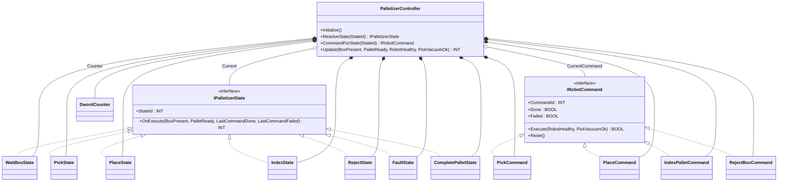
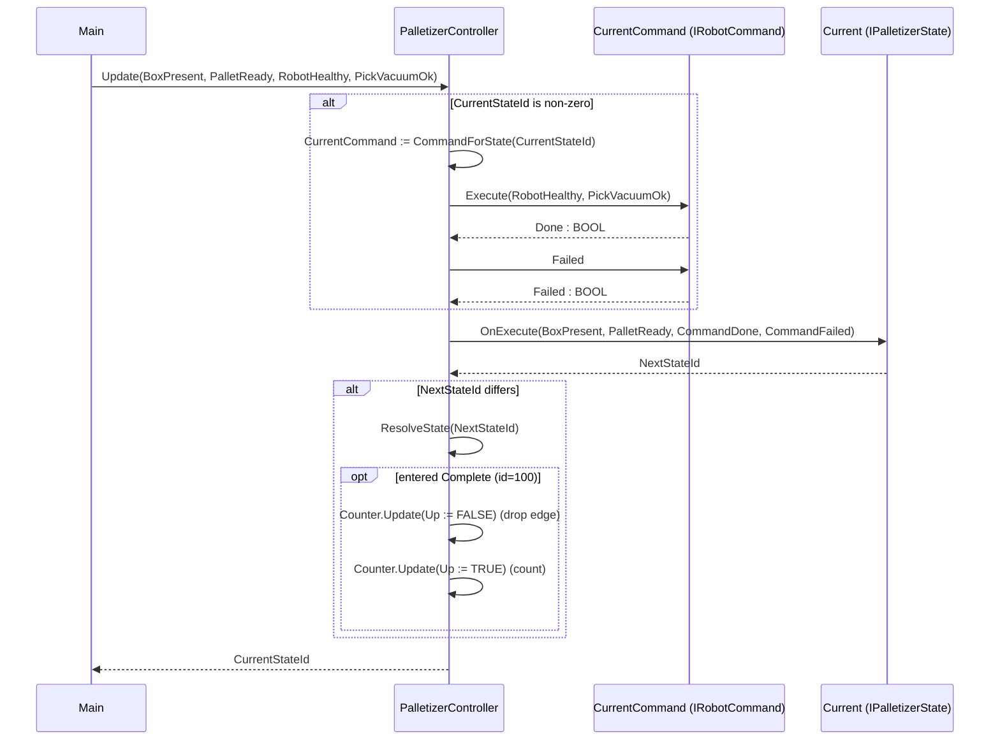

# Robotic Palletizer — Command + State

A six-axis robot picks bottle cases off a conveyor and stacks them on a
pallet. Each pallet position is one cycle through the same script: wait for
a box, pick, place, index the pallet, and either repeat or eject a bad
box. The OOP version separates the *what* of each cycle step (Pick, Place,
IndexPallet, RejectBox) from the *when* (the state graph that decides
which command runs next based on commands' Done/Failed reports plus
sensors). State objects own the transition graph; Command objects own the
robot motion and its success/failure semantics.

## When classic is the right answer

The procedural version is `non-oop/src/Main.st` (68 lines). Use it when:

- One robot, one part type, one pallet pattern that never changes.
- "Failure" means a single fault state — no per-command reject vs.
  retry vs. fault distinction.
- No need for the operator to inject ad-hoc commands (jog, calibrate,
  abort) outside the cycle.

The OOP version costs ~7× the lines. It earns that cost when commands
diverge in failure semantics (a vacuum loss is reject, a place-fault is
abort, an index-fault is just retry), when new commands have to be
inserted (calibration, dunnage placement), and when the state graph has
to reroute commands without rewriting every transition.

## Where classic strains

`ClassicPalletizer.Update` (lines 14-46 of `non-oop/src/Main.st`) is one
`CASE OF CurrentStateValue` where every arm sets `LastCommandIdValue` and
inlines the command's success/failure rule with a literal `IF` against
the same plant inputs (`RobotHealthy`, `PickVacuumOk`). Adding a "place
must verify torque before declaring done" rule means editing the place
arm to test a new input, then editing the place arm's failure transition
to point somewhere new. Adding a Reject step that is its own command
("eject the box, cycle the chute") means new state numbers, new CASE
arms, and renumbering existing transitions. Adding a maintenance command
("home all axes after every 20 pallets") means another CASE arm plus a
counter in the same method. By the third operator-injected command the
CASE block is the most-edited block in the project.

## Structure



`DwordCounter` comes from the OSCAT OOP library. The two interfaces, the
seven state FBs, the four command FBs, and `PalletizerController` are
defined in this example.

State id numbering: `0=WaitBox, 10=Pick, 20=Place, 30=Index, 40=Reject,
90=Fault, 100=Complete`. Numbers are gapped to allow inserting commands
(e.g., a Calibrate at 25) without renumbering.

## What happens at runtime



## The keystone

```st
(* State decides routing; Command decides "did the robot motion succeed". *)
IF CurrentStateIdValue <> INT#0 THEN
    CurrentCommand := CommandForState(StateId := CurrentStateIdValue);
    CommandDone := CurrentCommand.Execute(RobotHealthy := RobotHealthy,
        PickVacuumOk := PickVacuumOk);
    CommandFailed := CurrentCommand.Failed;
END_IF;
NextStateId := Current.OnExecute(BoxPresent := BoxPresent,
    PalletReady := PalletReady,
    LastCommandDone := CommandDone, LastCommandFailed := CommandFailed);
IF NextStateId <> CurrentStateIdValue THEN
    Current := ResolveState(StateId := NextStateId);
END_IF;
```

Adding a Calibrate command is a new `IRobotCommand`, a new
`IPalletizerState`, and one arm in `CommandForState`/`ResolveState`. The
success/failure semantics live with the command, not the state graph.

## Patterns used

- [Command](../../../docs/guides/oop-concepts-in-st.md#command)
- [State](../../../docs/guides/oop-concepts-in-st.md#state)

ST mechanics used:

- [Interface](../../../docs/guides/oop-concepts-in-st.md#interface) and
  [IMPLEMENTS](../../../docs/guides/oop-concepts-in-st.md#implements)
- [Polymorphism](../../../docs/guides/oop-concepts-in-st.md#polymorphism)
- [Composition](../../../docs/guides/oop-concepts-in-st.md#composition)

## What this demo doesn't show

- **Real motion.** `PickCommand.Execute` returns `Done := RobotHealthy
  AND PickVacuumOk` in one scan. A real Pick command has a multi-scan
  motion-finished handshake to the EtherCAT slave, plus interlocks, plus
  vacuum-decay verification.
- **Operator-injected commands.** The shape supports a "Calibrate"
  command outside the normal cycle but no `OperatorRequest` input is
  wired into the controller. A real cell would expose a queue of
  operator commands the controller can interleave between cycles.
- **Per-command tuning.** All commands take the same `(RobotHealthy,
  PickVacuumOk)` inputs. A real cell would parameterise each command
  with its own tuning record (max torque, dwell time, retract distance).
- **Pattern variants.** One pallet pattern is hard-wired
  (`IndexPalletCommand` always returns Done in one scan). A real
  palletizer drives a pattern generator that knows current row/column.

## When NOT to use this

- One-product, one-pattern cell that has run unchanged for years.
- No operator-injected commands needed (no calibrate, no jog).
- Single fault response — every failure goes to the same alarm and the
  whole cycle aborts.

## Integration map

| Tag | Address | Direction |
| --- | --- | --- |
| `Cell.BoxPresent` | `%IX0.0` | IN |
| `Cell.PalletReady` | `%IX0.1` | IN |
| `Cell.RobotHealthy` | `%IX0.2` | IN |
| `Cell.PickVacuumOk` | `%IX0.3` | IN |
| `Cell.RobotMoveOut` | `%QX0.0` | OUT |
| `Cell.RejectOut` | `%QX0.1` | OUT |

Comms (from `oop/io.toml`): `ethercat` (simulated master, 1 ms cycle),
`mqtt` (broker `127.0.0.1:1883`, topics
`packaging/palletizer/01/cmd` in, `packaging/palletizer/01/event` out).
Safe-state forces `Cell.RobotMoveOut := FALSE` on driver fault.

OPC UA exposed records (from `oop/runtime.toml`, namespace
`urn:trust:examples:robotic-palletizer-command-state`):
`Cell.CurrentStateId`, `Cell.CompletedPallets`, `Cell.LastCommandId`,
`Cell.Faulted`.

## Run

```bash
trust-runtime test --project examples/OSCAT/robotic_palletizer_command_state/non-oop
trust-runtime test --project examples/OSCAT/robotic_palletizer_command_state/oop
```

---

## Folder Layout

This paired example contains:

- `non-oop/` — the classic Structured Text project.
- `oop/` — the OSCAT OOP Structured Text project.

## What This Example Teaches

OOP pattern: Command + State. The OOP version pairs each cycle step with
a Command object that owns its success/failure rule, and a State object
that owns the routing graph; the non-oop version inlines both inside one
`CASE` block per state.

## How The Pair Teaches OOP

The teaching content above walks through the same machine in both
projects: where classic strains, the structural diagram of the OOP
version, the keystone snippet, and the integration map. Run the pair
side-by-side and read `non-oop/src/Main.st` first.
