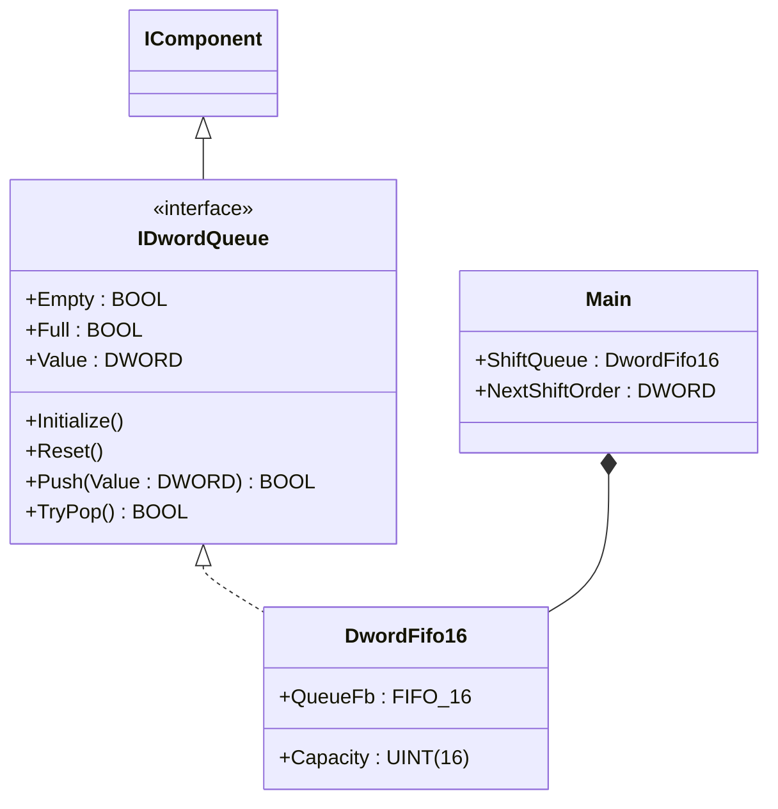
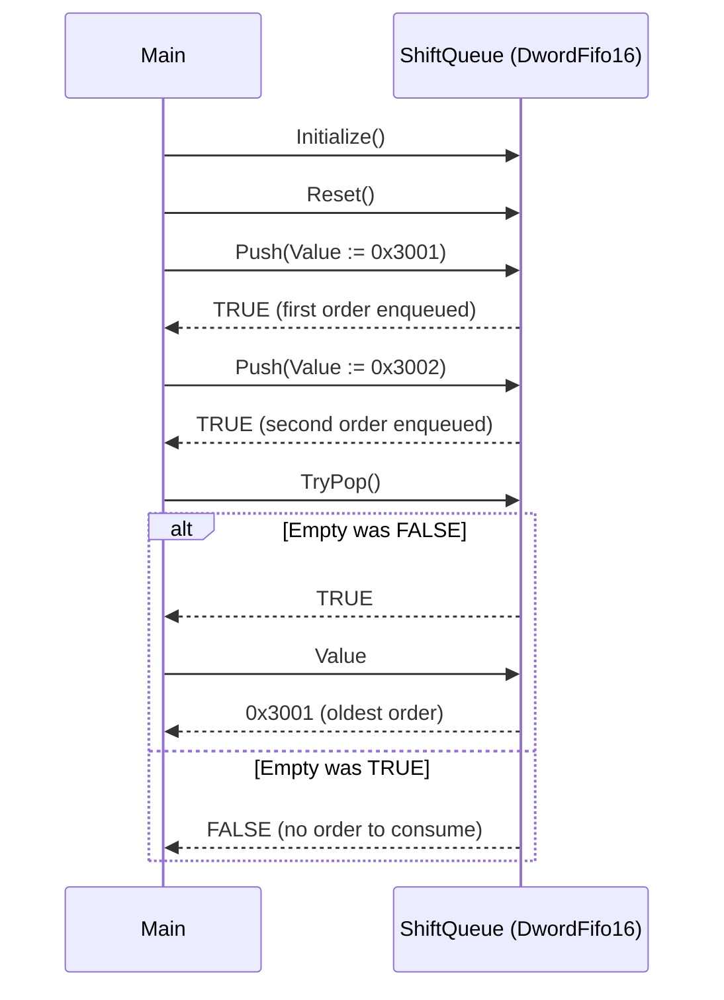

# Shift Order Queue — Composition

A production line buffers shift orders that arrive from MES planning. The
line consumes them in arrival order — the first order in is the first
order produced. The behaviour is naturally FIFO. This compact showcase
wires `DwordFifo16` from the OSCAT OOP library directly inside `Main` so
the call sequence the ST tests verify is the whole program.

## When classic is the right answer

The procedural version is `non-oop/src/Main.st` (11 lines). Use it when:

- One order slot — the next order overwrites the previous one with no
  buffer.
- Orders arrive at the same rate as production consumes them, so a queue
  never has more than one entry.
- Queue plumbing is never reused on another tag (no second queue for
  rework orders, no separate queue for tooling-change requests).

The OOP version uses `DwordFifo16` without adding custom function blocks
of its own. It earns its cost on the first reuse — when a second tag
needs the same arrival-order buffer, you instantiate two named components
instead of duplicating the underlying `FIFO_16` raw call sequence.

## Where classic strains

`non-oop/src/Main.st` (11 lines) drives the raw `FIFO_16` FB through the
OSCAT pulse contract: every call passes `DIN`, `E`, `RD`, `WD`, `RST`
even when only one matters. The reader has to know that `WD := TRUE`
means "write the value", that `RD := TRUE` means "pop", that you must
keep `E := TRUE` between calls or the queue is disabled, and that the
output `DOUT` only reflects the popped value when `RD := TRUE`. Adding a
second queue means duplicating this whole protocol; adding a guard for
"don't push if full" means reading `ShiftQueue.FULL` between every push.
By the second usage the call sites read more like a transcribed
schematic than reusable component code.

## Structure



`DwordFifo16` and the `IDwordQueue` interface come from the OSCAT OOP
library. `FIFO_16` is the underlying raw OSCAT function block; the OOP
wrapper hides the pulse-and-enable protocol behind named methods. This
example defines no FBs of its own — it shows the call sequence and how
the component integrates.

## What happens at runtime



## The keystone

```st
(* Push orders as they arrive; pop in arrival order. *)
ShiftQueue.Initialize();
ShiftQueue.Reset();
IF ShiftQueue.Push(Value := DWORD#16#3001) THEN
END_IF;
IF ShiftQueue.Push(Value := DWORD#16#3002) THEN
END_IF;
IF ShiftQueue.TryPop() THEN
    NextShiftOrder := ShiftQueue.Value;
END_IF;
```

`Push` returns FALSE on overflow (capacity 16); `TryPop` returns FALSE on
underflow. Both are safe to call unconditionally — the component owns
the guard. The raw `FIFO_16` pulse contract (`DIN`, `E`, `RD`, `WD`,
`RST`) disappears behind two named methods.

## Patterns used

- [Composition (the underlying mechanism)](../../../docs/guides/oop-concepts-in-st.md#composition)

ST mechanics used:

- [Interface](../../../docs/guides/oop-concepts-in-st.md#interface) and
  [IMPLEMENTS](../../../docs/guides/oop-concepts-in-st.md#implements)
- [Composition](../../../docs/guides/oop-concepts-in-st.md#composition)

## What this demo doesn't show

- **Capacity-full handling.** `Push` returns FALSE on overflow but `Main`
  uses `IF ... THEN END_IF` and discards the result. A real shift-order
  queue would log the overflow ("planning is over-committing the line")
  or backpressure the source.
- **Underflow as a UI signal.** `TryPop` on an empty queue returns FALSE;
  `Main` simply skips the assignment. A real HMI would surface "no
  pending orders" so operators don't think the line is broken.
- **Order metadata.** Pushed values are bare 32-bit codes (`0x3001`,
  `0x3002`). A real MES integration pairs each ID with a recipe, due
  date, lot count, and customer.
- **Multi-queue composition.** One queue is the whole program. A real
  line often pairs an order queue (FIFO) with a fault stack (LIFO) and a
  rework queue (FIFO). The same `DwordFifo16` and `DwordStack16` would
  compose cleanly.

## When NOT to use this

- One-order, one-slot line — a single `DWORD` variable is shorter than
  two FBs.
- Orders that must be consumed in priority order, not arrival order:
  use a sorted structure or a priority queue, not `DwordFifo16`.
- Plant that already has an MES order-management library you must use;
  bringing in `DwordFifo16` would duplicate plumbing.

## Why this is a showcase

The compact showcase is intentionally minimal. There is no MES, no
operator HMI, no priority handling, no MQTT order bus, no historian.
Process values are local literals so the ST tests exercise the FIFO
behaviour without external devices.

For composition combined with state machines and queues inside a real
plant see `cip_wash_state/oop` (State pattern with cycle counter) or
`pharma_filling_builder_state/oop` (Builder + State pairing recipes
with queues).

## Run

```bash
trust-runtime test --project examples/OSCAT/shift_order_queue/non-oop
trust-runtime test --project examples/OSCAT/shift_order_queue/oop
```

---

## Folder Layout

This paired example contains:

- `non-oop/` — the classic Structured Text project.
- `oop/` — the OSCAT OOP Structured Text project.

## What This Example Teaches

OOP pattern: Composition (compact showcase). The OOP version moves the
pulse-and-enable protocol behind a named component object with a tidy
public surface; the non-oop version inlines the raw `FIFO_16` calls in
procedural ST.

## How The Pair Teaches OOP

The teaching content above walks through the same machine in both
projects: where classic strains, the structural diagram of the OOP
version, the keystone snippet, and the call sequence. Run the pair
side-by-side and read `non-oop/src/Main.st` first.
