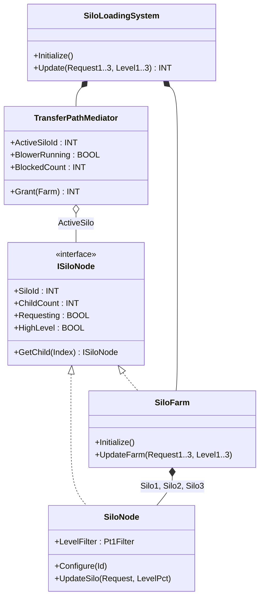
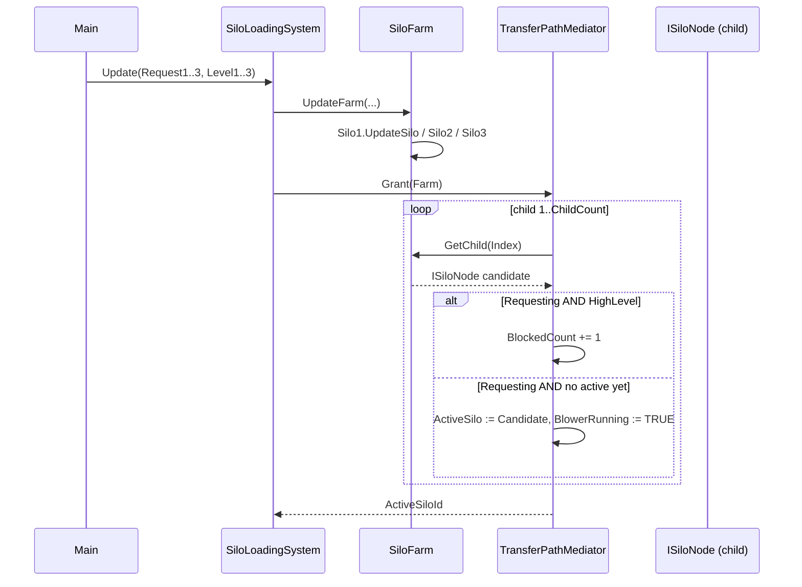

# Silo Loading System — Composite + Mediator

A bulk-powder transfer skid feeds three silos from a single pneumatic
blower with one shared diverter path. Several silos can request material
on the same scan, but the physical transfer path can only serve one at a
time, and any silo above 90 % must be skipped to prevent overfill. The
OOP version models the silo farm as a `Composite` (each silo and the
farm itself implement the same `ISiloNode` traversal contract) and pushes
the "who gets the blower this scan" decision into a `Mediator` that
treats the silos as opaque peers.

## When classic is the right answer

The procedural version is `non-oop/src/Main.st` (51 lines). Use it when:

- The skid has a fixed number of silos that will never grow.
- All silos use identical level instrumentation and the same high-level
  threshold.
- No future grouping (no "buffer silos vs. day silos") is anticipated.

The OOP version costs about 5× the lines. It earns that cost when the
silo count grows, sub-groups appear (a sub-farm of mineral silos with
their own blower share), or arbitration policy needs to evolve without
rewriting the per-silo update calls.

## Where classic strains

`ClassicSiloLoadingSystem.Update` (lines 8-36 of `non-oop/src/Main.st`)
is three near-identical IF/ELSIF blocks — one per silo — each duplicating
the high-level-blocked branch and the "first eligible wins" arbitration.
Adding a fourth silo means copy-pasting another block and remembering to
extend the `ActiveSiloIdValue = INT#0` chain through the new arm.
Changing the priority order (e.g., the largest silo first) means
manually reordering the blocks. Adding a sub-farm (silos 4-6 share a
second blower) requires duplicating the entire FB and then somehow
keeping the shared "any silo high-level" alarm wired to both. By the
second silo addition the procedural version has more branches than
process logic.

## Structure



`Pt1Filter` comes from the OSCAT OOP library (used inside each leaf for
level smoothing). The `ISiloNode` interface, both concretes, the
`TransferPathMediator`, and the `SiloLoadingSystem` controller are
defined in this example.

## What happens at runtime



## The keystone

```st
(* TransferPathMediator.Grant — treats every child uniformly *)
ActiveSiloIdValue := INT#0;
BlowerRunningValue := FALSE;
BlockedCountValue := INT#0;
FOR Index := INT#1 TO Farm.ChildCount DO
    Candidate := Farm.GetChild(Index := Index);
    IF Candidate.Requesting AND Candidate.HighLevel THEN
        BlockedCountValue := BlockedCountValue + INT#1;
    ELSIF Candidate.Requesting AND (ActiveSiloIdValue = INT#0) THEN
        ActiveSilo := Candidate;
        ActiveSiloIdValue := Candidate.SiloId;
        BlowerRunningValue := TRUE;
    END_IF;
END_FOR;
```

Adding a fourth silo is a one-line edit: bump `ChildCount` and add a
`Silo4` instance to `SiloFarm`. The mediator's `Grant` body is unchanged
because it iterates by `ChildCount`, not by silo number. The blocked-vs-
eligible policy lives in one place (the IF/ELSIF inside `Grant`), so a
plant-wide policy revision changes the mediator only.

## Patterns used

- [Composite](../../../docs/guides/oop-concepts-in-st.md#composite)
- [Mediator](../../../docs/guides/oop-concepts-in-st.md#mediator)

ST mechanics used:

- [Interface](../../../docs/guides/oop-concepts-in-st.md#interface) and
  [IMPLEMENTS](../../../docs/guides/oop-concepts-in-st.md#implements)
- [Polymorphism](../../../docs/guides/oop-concepts-in-st.md#polymorphism)
- [Composition](../../../docs/guides/oop-concepts-in-st.md#composition)

## What this demo doesn't show

- **Multi-level Composite.** `SiloFarm.GetChild` returns leaves only.
  A real multi-site bulk-powder plant would have `SiloFarm` containing
  `Building1Farm` and `Building2Farm`, each itself a Composite — recursing
  through `ISiloNode.ChildCount` would walk the whole tree. This demo
  flattens to one level.
- **Diverter feedback / closed-loop confirmation.** The mediator picks
  an active silo and asserts `BlowerRunning`, but there is no diverter
  position feedback or "command timed out" fault. Real systems wait for
  the diverter limit-switch before energizing the blower.
- **Blower starve / pressure protection.** A real transfer path checks
  blower pressure before granting a new silo. The library has
  `Pt1Filter` for the level signal but no pressure model in this demo.
- **Level filter for HighLevel decisions.** Each `SiloNode` filters the
  level into `LevelFilter` and the property tests the filtered value.
  In real plants the high-level decision usually consumes both raw and
  filtered values (raw to trip immediately above an upper hard limit,
  filtered for soft-limit enforcement). This demo uses one threshold.

## When NOT to use this

- One-silo skid where arbitration is meaningless.
- Two silos with identical priority that always feed in lockstep — a
  single FB with two parameter blocks is shorter.
- Plants where the blower is dedicated per silo (no shared resource);
  the Mediator role disappears.

## Integration map

| Tag | Address | Direction |
| --- | --- | --- |
| `System.Silo1Request` | `%IX0.0` | IN |
| `System.Silo2Request` | `%IX0.1` | IN |
| `System.Silo3Request` | `%IX0.2` | IN |
| `System.Silo1LevelRaw` | `%IW0` | IN |
| `System.Silo2LevelRaw` | `%IW2` | IN |
| `System.Silo3LevelRaw` | `%IW4` | IN |
| `System.BlowerOut` | `%QX0.0` | OUT |
| `System.Diverter1Out` | `%QX0.1` | OUT |
| `System.Diverter2Out` | `%QX0.2` | OUT |
| `System.Diverter3Out` | `%QX0.3` | OUT |

Comms (from `oop/io.toml`): `modbus-tcp` (slave 90 on `127.0.0.1:1507`),
`mqtt` (broker `127.0.0.1:1883`, topics `bulk/silo/cmd` in,
`bulk/silo/transfer` out). Safe-state forces `System.BlowerOut := FALSE`
on driver fault.

OPC UA exposed records (from `oop/runtime.toml`, namespace
`urn:trust:examples:silo-loading-composite-mediator`):
`System.ActiveSiloId`, `System.BlowerRunning`, `System.BlockedCount`.

## Run

```bash
trust-runtime test --project examples/OSCAT/silo_loading_composite_mediator/non-oop
trust-runtime test --project examples/OSCAT/silo_loading_composite_mediator/oop
```

---

## Folder Layout

This paired example contains:

- `non-oop/` — the classic Structured Text project.
- `oop/` — the OSCAT OOP Structured Text project.

## What This Example Teaches

OOP pattern: Composite + Mediator. The OOP version moves decisions
behind named function-block instances and an interface contract; the
non-oop version inlines those decisions in procedural ST.

## How The Pair Teaches OOP

The teaching content above walks through the same machine in both
projects: where classic strains, the structural diagram of the OOP
version, the keystone snippet, and the integration map. Run the pair
side-by-side and read `non-oop/src/Main.st` first.
