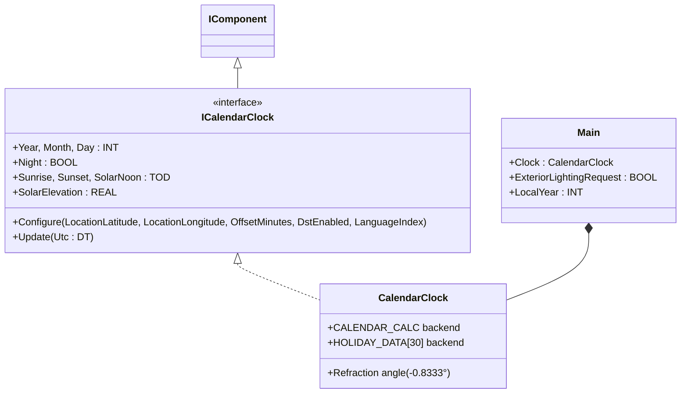
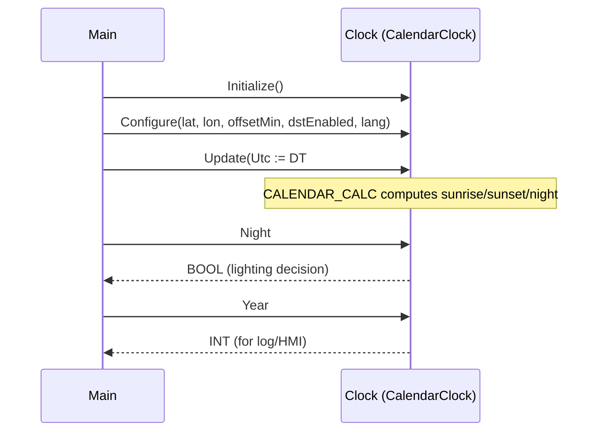

# Solar Lighting Clock — Composition

A municipal park's exterior lighting must turn on at dusk and off at
dawn. The astronomical sunset/sunrise depends on latitude, longitude,
day-of-year, and DST. Stockholm at 59.33° N has a four-hour difference
between June and December sunset. This compact showcase wires
`CalendarClock` from the OSCAT OOP library directly inside `Main` so the
call sequence the ST tests verify is the whole program.

## When classic is the right answer

The procedural version is `non-oop/src/Main.st` (21 lines). Use it when:

- One site, one fixed schedule (lights from 17:00 to 06:00 year-round
  is a single timer, not a clock).
- A photocell input drives the lighting decision directly — no need for
  the controller to know astronomical time.
- The classic OSCAT `CALENDAR_CALC` call is the only place these
  parameters appear; no second consumer needs the same timezone offset.

The OOP version uses `CalendarClock` without adding custom function
blocks of its own. It earns its cost when multiple consumers need the
same site time (lighting + irrigation + heating schedule + access
control), or when the location parameters move from "code constants" to
"runtime configuration".

## Where classic strains

`non-oop/src/Main.st` (21 lines) builds an inline `CALENDAR` record,
fills six fields by hand (`UTC`, `DST_EN`, `OFFSET`, `LANGUAGE`,
`LATITUDE`, `LONGITUDE`), passes that struct plus a holidays array into
`CALENDAR_CALC` along with the magic refraction angle `H :=
REAL#-0.8333333`, then reads `CalendarData.NIGHT` back out of the same
struct the function mutated. Anyone reading this code has to know what
that magic angle is, which fields the function mutates, and which it
just reads. Adding a second site means duplicating the whole record
fill; adding an irrigation schedule means a second copy of the same
calendar setup three pages later. By the third consumer the calendar
plumbing dwarfs the actual schedule logic.

## Structure



`CalendarClock` and the `ICalendarClock` interface come from the OSCAT
OOP library. The classic `CALENDAR_CALC` block, the holidays array, and
the refraction angle live inside the wrapper. This example defines no
FBs of its own — it shows the call sequence and how the component
integrates.

## What happens at runtime



## The keystone

```st
(* One Configure call, one Update per scan, then read named properties. *)
Clock.Initialize();
Clock.Configure(
    LocationLatitude := REAL#59.3293,
    LocationLongitude := REAL#18.0686,
    OffsetMinutes := INT#60,
    DstEnabled := TRUE,
    LanguageIndex := INT#1
);
Clock.Update(Utc := DT#2026-04-26-10:00:00);
ExteriorLightingRequest := Clock.Night;
LocalYear := Clock.Year;
```

The site parameters live in one Configure call. The refraction angle
`-0.8333°` is hidden inside the wrapper. The `HOLIDAY_DATA` array that
the classic version threads through `CALENDAR_CALC` is private to the
component. Adding a second consumer reads the same `Clock.Night` —
parameters are not duplicated.

## Patterns used

- [Composition (the underlying mechanism)](../../../docs/guides/oop-concepts-in-st.md#composition)

ST mechanics used:

- [Interface](../../../docs/guides/oop-concepts-in-st.md#interface) and
  [IMPLEMENTS](../../../docs/guides/oop-concepts-in-st.md#implements)
- [Composition](../../../docs/guides/oop-concepts-in-st.md#composition)

## What this demo doesn't show

- **Holiday awareness.** `CalendarClock` exposes `Holiday` and
  `HolidayName` properties but the showcase ignores them. A real lighting
  controller might extend night hours on certain holidays.
- **DST transition.** `DstEnabled := TRUE` is set but the showcase tests
  one fixed UTC. The component handles spring/autumn DST transitions but
  the demo doesn't exercise both sides.
- **Twilight phases.** Night is a single BOOL. Civil twilight, nautical
  twilight, and astronomical twilight are distinct lighting cues for
  different consumer classes; the wrapper currently flattens them.
- **Multiple sites.** One `CalendarClock` instance is the whole program.
  A real estate manager would have one clock per site/timezone and read
  them by reference.

## When NOT to use this

- Single fixed schedule (17:00–06:00) — a `TON` timer is shorter than a
  calendar component.
- Photocell-driven lighting where the analog sensor is the source of
  truth — astronomical time is not needed.
- Plant that already imports a vendor scheduling library; bringing in
  `CalendarClock` would duplicate plumbing.

## Why this is a showcase

The compact showcase is intentionally minimal. There is no MQTT schedule
publisher, no historian, no holiday calendar configuration UI, no
multi-site orchestration. UTC is a literal constant so the ST tests
exercise the deterministic calendar arithmetic without external devices.

For composition combined with state machines and multiple consumers see
`cold_storage_plant/oop` (composite tree of rooms with shared
maintenance subscribers).

## Run

```bash
trust-runtime test --project examples/OSCAT/solar_lighting_clock/non-oop
trust-runtime test --project examples/OSCAT/solar_lighting_clock/oop
```

---

## Folder Layout

This paired example contains:

- `non-oop/` — the classic Structured Text project.
- `oop/` — the OSCAT OOP Structured Text project.

## What This Example Teaches

OOP pattern: Composition (compact showcase). The OOP version moves the
calendar struct fill and `CALENDAR_CALC` invocation behind a named
component object with a tidy public surface; the non-oop version inlines
the raw `CALENDAR` struct and `CALENDAR_CALC` call in procedural ST.

## How The Pair Teaches OOP

The teaching content above walks through the same machine in both
projects: where classic strains, the structural diagram of the OOP
version, the keystone snippet, and the call sequence. Run the pair
side-by-side and read `non-oop/src/Main.st` first.
