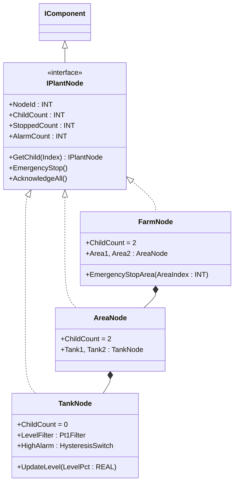
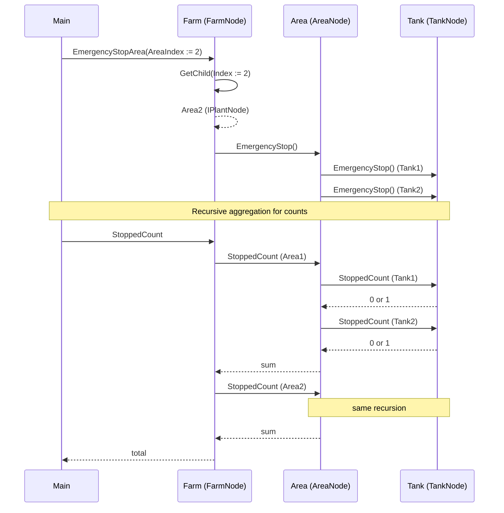

# Tank Farm Transfer Skid — Composite + Iterator

A solvent tank farm has two areas; each area has two storage tanks. The
operator at the central console must be able to stop "everything in
area 2" without knowing how many tanks live there, acknowledge every
alarm beneath any node, and read aggregated stopped/alarm counts at the
farm level. The OOP version exposes a uniform `IPlantNode` interface so
leaves (tanks) and composites (areas, the whole farm) accept the same
operations; callers walk the tree through `ChildCount` and
`GetChild(Index)` without hard-coded references.

## When classic is the right answer

The procedural version is `non-oop/src/Main.st` (59 lines). Use it when:

- The plant has exactly two areas with two tanks each, frozen at design
  time.
- All operator commands target the whole farm (no per-area emergency
  stop, no per-tank acknowledgment).
- Adding a third tank means rewriting the controller (acceptable if it
  hasn't happened in five years).

The OOP version costs ~7× the lines. It earns that cost when plant
structure changes (a new area is added, a tank is taken out of service),
when commands must target arbitrary subtrees (stop area 2, acknowledge
all alarms under tank 3), and when the same farm-walking code must
recurse through any depth.

## Where classic strains

`TankFarmClassic` (lines 1-52 of `non-oop/src/Main.st`) declares each
tank as a separate flat field (`Area1Tank1Stopped`, `Area1Tank2Stopped`,
`Area2Tank1Stopped`, ...). `EmergencyStopArea` is a CASE that names each
tank explicitly: stopping area 1 sets `Area1Tank1Stopped` and
`Area1Tank2Stopped`. Adding a third tank to area 2 means another field
in the FB, another `IF` arm in `EmergencyStopArea`, another increment in
`StoppedCount`, and another condition in every consumer. Adding an
"acknowledge area" operation (currently it's only acknowledge-all) means
duplicating the whole CASE. By the second new tank the FB is mostly
boilerplate referring to specific tanks by name.

## Structure



`Pt1Filter`, `HysteresisSwitch`, and the `IComponent` contract come from
the OSCAT OOP library. `IPlantNode`, `TankNode`, `AreaNode`, and
`FarmNode` are defined in this example. Note that `TankNode.GetChild`
returns `THIS` (a leaf is its own child); the iterator caller is
expected to stop descending when `ChildCount = 0`.

## What happens at runtime



## The keystone

```st
(* Iterator: walk the tree through ChildCount/GetChild without
   knowing the concrete shape. Composite: same call works at any
   level. *)
TotalTankAlarms := INT#0;
FOR AreaIndex := INT#1 TO Farm.ChildCount DO
    Area := Farm.GetChild(Index := AreaIndex);
    FOR TankIndex := INT#1 TO Area.ChildCount DO
        Tank := Area.GetChild(Index := TankIndex);
        TotalTankAlarms := TotalTankAlarms + Tank.AlarmCount;
    END_FOR;
END_FOR;
```

Adding a third tank in `AreaNode` is one new field plus one arm in
`GetChild`. The Main scan loop is unchanged. Adding a "Region" composite
that owns farms is a new FB implementing `IPlantNode`; the same Main
walk works one level deeper.

## Patterns used

- [Composite](../../../docs/guides/oop-concepts-in-st.md#composite)
- [Iterator](../../../docs/guides/oop-concepts-in-st.md#iterator)

ST mechanics used:

- [Interface](../../../docs/guides/oop-concepts-in-st.md#interface) and
  [IMPLEMENTS](../../../docs/guides/oop-concepts-in-st.md#implements)
- [Polymorphism](../../../docs/guides/oop-concepts-in-st.md#polymorphism)
- [Composition](../../../docs/guides/oop-concepts-in-st.md#composition)

## What this demo doesn't show

- **Variable-arity composites.** `AreaNode` always has exactly two
  tanks; `FarmNode` always has exactly two areas. A real composite tree
  uses an array of children sized at runtime. The shape supports it; the
  example uses fixed fields for clarity.
- **Per-tank tuning.** `TankNode.Initialize` sets the same alarm limits
  (5 % low, 90 % high) for every tank. A real plant would have
  per-tank engineering ranges fed in at Configure time.
- **Snapshot/restore for the whole tree.** `Snapshot` is implemented at
  each node but the demo doesn't aggregate snapshots into a tree-wide
  health record.
- **Heterogeneous nodes.** Every leaf is a `TankNode`. A real plant has
  tanks, transfer pumps, and valve clusters as different leaf types.
  The interface supports it; the demo doesn't exercise it.

## When NOT to use this

- A two-area, two-tanks-per-area plant frozen at design time — the
  procedural version is shorter.
- Operator commands always target "everything" — no Iterator needed when
  there are no subtrees.
- Plant where every leaf is identical and behaviour never changes —
  Composite is overkill if a simple counter does the job.

## Integration map

| Tag | Address | Direction |
| --- | --- | --- |
| `Farm.AreaStopCommand` | `%IX0.0` | IN |
| `Farm.AreaIndex` | `%IW0` | IN |
| `Farm.AreaStoppedOut` | `%QX0.0` | OUT |

Comms (from `oop/io.toml`): `mqtt` (broker `127.0.0.1:1883`,
topics `tankfarm/cmd` in, `tankfarm/alarm` out). Safe-state forces
`Farm.AreaStoppedOut := FALSE` on driver fault.

OPC UA exposed records (from `oop/runtime.toml`, namespace
`urn:trust:examples:tank-farm`): `Farm.ChildCountValue`,
`Farm.StoppedCountValue`, `Farm.AlarmCountValue`.

## Run

```bash
trust-runtime test --project examples/OSCAT/tank_farm_transfer_skid/non-oop
trust-runtime test --project examples/OSCAT/tank_farm_transfer_skid/oop
```

---

## Folder Layout

This paired example contains:

- `non-oop/` — the classic Structured Text project.
- `oop/` — the OSCAT OOP Structured Text project.

## What This Example Teaches

OOP pattern: Composite + Iterator. The OOP version unifies leaf and
composite behind one `IPlantNode` interface so callers walk the tree
through `ChildCount` and `GetChild(Index)`; the non-oop version names
each tank explicitly in flat fields and inlines tree walks as repeated
boolean OR operations.

## How The Pair Teaches OOP

The teaching content above walks through the same machine in both
projects: where classic strains, the structural diagram of the OOP
version, the keystone snippet, and the integration map. Run the pair
side-by-side and read `non-oop/src/Main.st` first.
