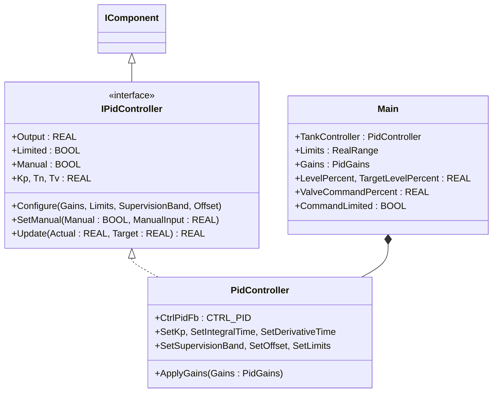
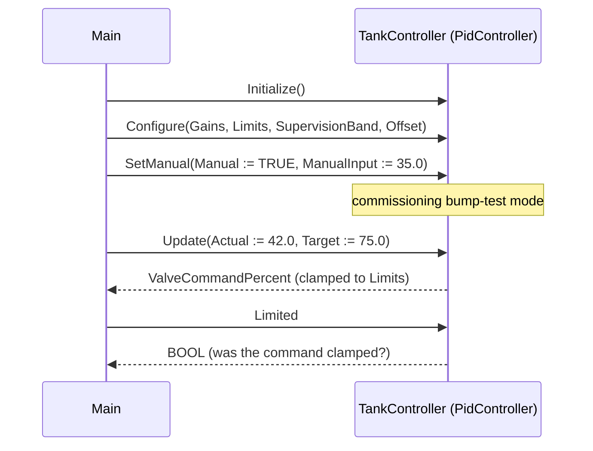

# Tank Level PID — Composition

A storage tank's level is held at a target setpoint by modulating an
inlet or outlet valve. The controller reads tank level (0–100 %) and
writes a valve command (0–100 %). During commissioning the operator
needs to put the loop in manual to bump the valve and watch the
response, then switch to auto for production. The OOP version wraps the
classic OSCAT `CTRL_PID` block in a `PidController` component so the
configuration record, the manual/auto switch, and the per-scan update
are three explicit method calls instead of one 12-parameter FB call.

## When classic is the right answer

The procedural version is `non-oop/src/Main.st` (26 lines). Use it when:

- The PID gains are fixed at design time and never tuned in production.
- No manual/auto switching is needed (loop runs in auto forever).
- One loop in the whole project; the 12-argument FB call is not
  duplicated anywhere else.

The OOP version uses `PidController` without adding custom function
blocks of its own. It earns its cost the moment commissioning needs to
change tunings without rewriting the call site, when manual/auto
switching is needed, or when a second loop must reuse the same
configuration shape.

## Where classic strains

`non-oop/src/Main.st` (26 lines) calls `CTRL_PID` with 12 named
arguments per cycle, mixing tuning constants (`KP`, `TN`, `TV`),
operating limits (`LL`, `LH`), and per-scan inputs (`ACT`, `SET_POINT`,
`MAN`, `M_I`) at the same call. Every commissioning change to gains
edits the same call site that the cyclic update uses; flipping
manual/auto means flipping `MAN` and `M_I` directly in the line that
also reads the level. Adding a second loop means duplicating the whole
12-argument signature. By the second loop the PID call site is the
longest line in every program and the easiest to mis-edit.

## Structure



`PidController`, `RealRange`, `PidGains`, and the `IPidController`
interface come from the OSCAT OOP library. `CTRL_PID` is the underlying
classic OSCAT function block; the OOP wrapper hides the 12-argument
contract behind named methods. This example defines no FBs of its own
— it shows the call sequence and how the component integrates.

## What happens at runtime



## The keystone

```st
(* Three named calls replace the 12-argument FB invocation. *)
TankController.Initialize();
TankController.Configure(Gains := Gains, Limits := Limits,
    SupervisionBand := REAL#0.0, Offset := REAL#0.0);
TankController.SetManual(Manual := TRUE, ManualInput := REAL#35.0);
ValveCommandPercent := TankController.Update(
    Actual := LevelPercent, Target := TargetLevelPercent);
CommandLimited := TankController.Limited;
```

The configuration record (`PidGains`, `RealRange`) lives separately from
the per-scan call. Manual/auto is one method call, not a flag mixed in
with the level reading. Adding a second loop is a second
`PidController` field with its own configuration. Tuning lives where
commissioning expects it — in the configure record, not in the cyclic
update.

## Patterns used

- [Composition (the underlying mechanism)](../../../docs/guides/oop-concepts-in-st.md#composition)

ST mechanics used:

- [Interface](../../../docs/guides/oop-concepts-in-st.md#interface) and
  [IMPLEMENTS](../../../docs/guides/oop-concepts-in-st.md#implements)
- [Composition](../../../docs/guides/oop-concepts-in-st.md#composition)

## What this demo doesn't show

- **Bumpless transfer.** Switching from manual to auto can produce a
  step in the output unless the controller initialises its integrator
  to match the manual command. The wrapper exposes `SetManual` but the
  showcase does not exercise the bumpless transition path.
- **Anti-windup.** When the output saturates (Limited = TRUE), a
  well-tuned controller stops integrating. The component delegates this
  to `CTRL_PID`; the showcase doesn't exercise the wind-up scenario.
- **Cascade loops.** A real tank-level controller often has an outer
  level loop trimming an inner flow loop's setpoint. One PID is the
  whole program here.
- **Gain scheduling.** Tank dynamics change with level (low level =
  small surface area, fast change). The wrapper supports per-call gain
  changes via `SetKp` etc., but the showcase keeps a single fixed gain.

## When NOT to use this

- One-shot fixed valve command (no closed loop) — a constant assignment
  is shorter than a PID.
- Single fixed-tuning loop that has run unchanged for years — the
  classic 12-argument call is acceptable when nothing ever edits it.
- Plant that already imports a vendor PID library; bringing in
  `PidController` would duplicate plumbing.

## Why this is a showcase

The compact showcase is intentionally minimal. There is no Modbus loop
to a transmitter, no MQTT publish of the controller state, no
historian, no anti-windup demonstration, no bumpless-transfer demo.
Process values are local literals so the ST tests exercise the
configuration + manual/auto + clamp behaviour without external devices.

For a PID composed inside a larger plant with strategy-driven tuning
see `hvac_air_handling_unit/oop` (each Strategy owns its own filter and
gain); for cascade control see `boiler_room_heating_plant/oop`.

## Run

```bash
trust-runtime test --project examples/OSCAT/tank_level_pid/non-oop
trust-runtime test --project examples/OSCAT/tank_level_pid/oop
```

---

## Folder Layout

This paired example contains:

- `non-oop/` — the classic Structured Text project.
- `oop/` — the OSCAT OOP Structured Text project.

## What This Example Teaches

OOP pattern: Composition (compact showcase). The OOP version moves the
12-argument `CTRL_PID` call behind a named component object with a
configure record and named methods; the non-oop version inlines all
12 parameters at the same call site as the cyclic update.

## How The Pair Teaches OOP

The teaching content above walks through the same machine in both
projects: where classic strains, the structural diagram of the OOP
version, the keystone snippet, and the call sequence. Run the pair
side-by-side and read `non-oop/src/Main.st` first.
