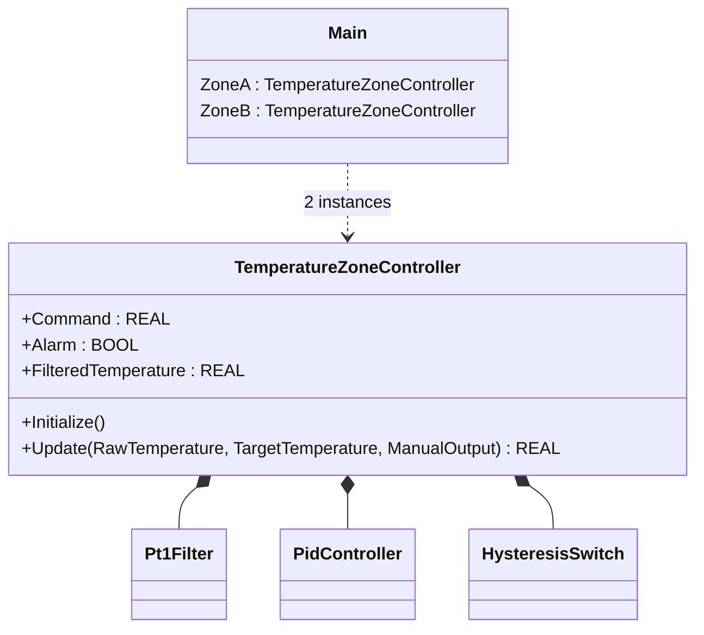

# Temperature Zone Composition — Showcase

This is a compact showcase, not a real machine. It demonstrates one thing:
how composition collapses repeated wiring across multiple devices. Each
"zone" needs filter + PID + alarm wired in the same order. The procedural
version repeats that wiring per zone; the OOP version owns the wiring once
inside `TemperatureZoneController` and instantiates the controller per
zone.

For the same shape applied to a real industrial scenario with permissives,
state machine, and comms, see `cold_storage_plant/oop` (composite plant
hierarchy with multiple rooms) or `boiler_room_heating_plant/oop` (a
station facade composing many internals).

## Structure



`Pt1Filter`, `PidController`, and `HysteresisSwitch` come from the OSCAT
OOP library. Only `TemperatureZoneController` is defined in this example.

## The keystone

```st
(* The composed FB owns the per-zone wiring once *)
Filter.Update(Sample := RawTemperature);
Controller.Update(Actual := FilteredTemperatureValue, Target := TargetTemperature);
AlarmSwitch.Update(MeasuredValue := FilteredTemperatureValue);

(* Main creates two independent zones with one line each *)
ZoneA.Update(RawTemperature := REAL#21.0, TargetTemperature := REAL#23.0, ManualOutput := REAL#45.0);
ZoneB.Update(RawTemperature := REAL#18.0, TargetTemperature := REAL#22.0, ManualOutput := REAL#55.0);
AnyAlarm := ZoneA.Alarm OR ZoneB.Alarm;
```

The procedural version declares six FB instances in Main (`ZoneAFilter`,
`ZoneAController`, `ZoneAAlarm`, `ZoneBFilter`, ...) and inlines the
filter→controller→alarm wiring twice — once per zone. Adding Zone C means
adding three more FBs and another four-line block. The OOP version adds
`ZoneC : TemperatureZoneController;` plus one `Initialize` and one
`Update` call. The internal wiring is owned by the composed FB and never
duplicated.

## Patterns used

- [Composition (the underlying mechanism)](../../../docs/guides/oop-concepts-in-st.md#composition)

ST mechanics used:

- [Composition](../../../docs/guides/oop-concepts-in-st.md#composition)

## Why this is a showcase, not a real machine

The showcase is intentionally minimal. There are no field signals, no
state machine, no alarms beyond a single hysteresis switch, and no comms
boundary. `oop/io.toml` does not exist; `oop/runtime.toml` configures only
runtime control, logging, and the watchdog/fault policy. Process values
are local literals so the ST tests exercise the composition behavior
without external devices.

For composition combined with patterns inside a real-world plant, see
`cold_storage_plant/oop` or `boiler_room_heating_plant/oop`.

## Run

```bash
trust-runtime test --project examples/OSCAT/temperature_zone_composition/non-oop
trust-runtime test --project examples/OSCAT/temperature_zone_composition/oop
```

---

## Folder Layout

This paired example contains:

- `non-oop/` — the classic Structured Text project.
- `oop/` — the OSCAT OOP Structured Text project.

## What This Example Teaches

OOP pattern: Composition (compact showcase). The OOP version moves decisions behind named
function-block instances and an interface contract; the non-oop version
inlines those decisions in procedural ST.

## How The Pair Teaches OOP

The teaching content above walks through the same machine in both
projects: where classic strains, the structural diagram of the OOP
version, the keystone snippet, and the integration map. Run the pair
side-by-side and read `non-oop/src/Main.st` first.
