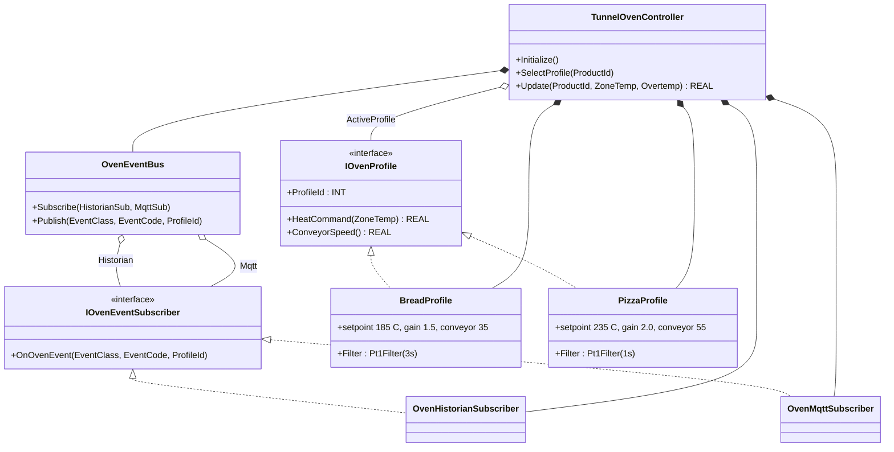
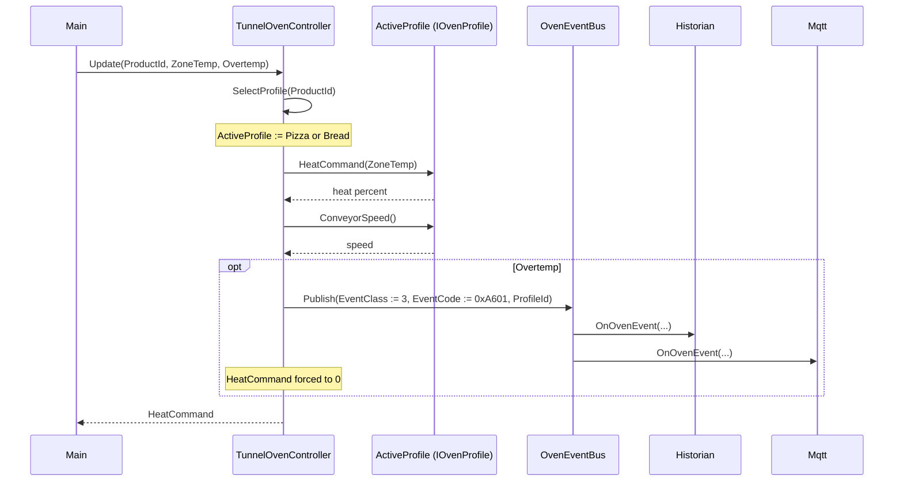

# Tunnel Oven — Strategy + Observer

A bakery tunnel oven runs many products through one heat tunnel. Bread
needs a 185°C set, slow conveyor, and gentle filter. Pizza needs 235°C,
faster conveyor, and a quicker filter. Quality and overtemperature
events must reach a historian, an MQTT bus, and an HMI without any of
those consumers blocking the heat-control loop. The OOP version puts
each product profile behind one interface and fans events out through a
subscriber bus.

## When classic is the right answer

The procedural version is `non-oop/src/Main.st` (56 lines). Use it when:

- The oven runs one product type for the lifetime of the line.
- Two products that differ only in setpoint magnitude — pass setpoint as
  a parameter, do not split into strategies.
- There is exactly one alarm consumer (a single coil or local lamp), so
  the fan-out bus buys nothing.

The OOP version costs about 4× the lines. It earns that cost when new
products keep getting introduced (sourdough, bagel, focaccia each with
their own profile) and when each new event consumer (MES, historian,
MQTT, alarm panel) must subscribe without touching the heat-control
scan.

## Where classic strains

`ClassicTunnelOven.Update` (lines 9-29 of `non-oop/src/Main.st`) is one
`IF/ELSE` over `ProductId`. The bread arm sets profile id, conveyor,
heat formula. The pizza arm does the same with different magic numbers.
Adding a focaccia profile means a third arm with its own filter time
constant, conveyor, and gain — copied from the bread arm and edited.
Adding an MQTT-only event means widening every product arm so the
classic body knows about both consumers. The overtemp branch sets two
state flags inline (`QualityEventCountValue`, `MqttPublishReadyValue`);
adding a third subscriber (an HMI banner) means yet another flag and
another inline write per branch.

## Structure



`Pt1Filter` comes from the OSCAT OOP library. `IOvenProfile`,
`IOvenEventSubscriber`, the two profile FBs, the two subscriber FBs,
`OvenEventBus`, and `TunnelOvenController` are defined in this example.

## What happens at runtime



## The keystone

```st
(* TunnelOvenController.Update — strategy call + event fan-out *)
SelectProfile(ProductId := ProductId);
ZoneHeatCommandValue := ActiveProfile.HeatCommand(ZoneTemp := ZoneTemp);
ConveyorSpeedValue := ActiveProfile.ConveyorSpeed();
IF Overtemp THEN
    ZoneHeatCommandValue := REAL#0.0;
    Bus.Publish(EventClass := BYTE#3, EventCode := WORD#16#A601,
        ProfileId := ActiveProfile.ProfileId);
END_IF;
```

Adding a focaccia profile is a new FB implementing `IOvenProfile` and a
new arm in `SelectProfile`. Adding an alarm panel is a new FB
implementing `IOvenEventSubscriber` and one new field on
`OvenEventBus`. Neither change touches the keystone.

## Patterns used

- [Strategy](../../../docs/guides/oop-concepts-in-st.md#strategy)
- [Observer](../../../docs/guides/oop-concepts-in-st.md#observer)

ST mechanics used:

- [Interface](../../../docs/guides/oop-concepts-in-st.md#interface) and
  [IMPLEMENTS](../../../docs/guides/oop-concepts-in-st.md#implements)
- [Polymorphism](../../../docs/guides/oop-concepts-in-st.md#polymorphism)
- [Composition](../../../docs/guides/oop-concepts-in-st.md#composition)

## What this demo doesn't show

- **Profile per zone.** A real tunnel oven has 4-6 thermal zones, each
  with its own profile sample. This demo collapses to one zone temp.
- **Subscriber lifecycle.** `OnOvenEvent` runs in scan; a real subscriber
  would queue into a `DwordFifo16` so a slow MQTT path cannot stall the
  control scan. The `boiler_feedwater_alarm` showcase pairs nicely.
- **Profile-loading from recipe storage.** Profiles are compiled-in
  rather than loaded from a recipe table — production lines store
  profiles in retain or on a recipe server.
- **Alarm acknowledgement.** Quality events accumulate but never reset.
  Real plants need an ack path that drains the historian counter and
  resets `MqttPublishReady`.

## When NOT to use this

- A single-product oven with one heat profile and no expected new
  products.
- Two products that differ only in numeric setpoint — a parameter on
  one FB is shorter than two strategy FBs.
- One alarm consumer (single coil) — the bus is overhead with no
  payoff.

## Integration map

| Tag | Address | Direction |
| --- | --- | --- |
| `Oven.ProductId` | `%IW0` | IN |
| `Oven.ZoneTempRaw` | `%IW2` | IN |
| `Oven.OvertempInput` | `%IX0.0` | IN |
| `Oven.HeatCommandRaw` | `%QW0` | OUT |
| `Oven.ConveyorSpeedRaw` | `%QW2` | OUT |
| `Oven.AlarmOut` | `%QX0.0` | OUT |

Comms (from `oop/io.toml`): `modbus-tcp` (unit 100 on `127.0.0.1:1508`),
`mqtt` (broker `127.0.0.1:1883`, topics `bakery/oven/01/cmd` in,
`bakery/oven/01/event` out). Safe-state forces `Oven.AlarmOut := FALSE`
on driver fault.

OPC UA exposed records (from `oop/runtime.toml`, namespace
`urn:trust:examples:tunnel-oven-strategy-observer`):
`Oven.ActiveProfileId`, `Oven.ZoneHeatCommand`, `Oven.ConveyorSpeed`,
`Oven.QualityEventCount`.

## Run

```bash
trust-runtime test --project examples/OSCAT/tunnel_oven_strategy_observer/non-oop
trust-runtime test --project examples/OSCAT/tunnel_oven_strategy_observer/oop
```

---

## Folder Layout

This paired example contains:

- `non-oop/` — the classic Structured Text project.
- `oop/` — the OSCAT OOP Structured Text project.

## What This Example Teaches

OOP pattern: Strategy + Observer. The OOP version moves product-specific
heat profiles behind named function-block instances and fans quality
events through subscriber objects; the non-oop version inlines product
arms and event flags in procedural ST.

## How The Pair Teaches OOP

The teaching content above walks through the same machine in both
projects: where classic strains, the structural diagram of the OOP
version, the keystone snippet, and the integration map. Run the pair
side-by-side and read `non-oop/src/Main.st` first.
