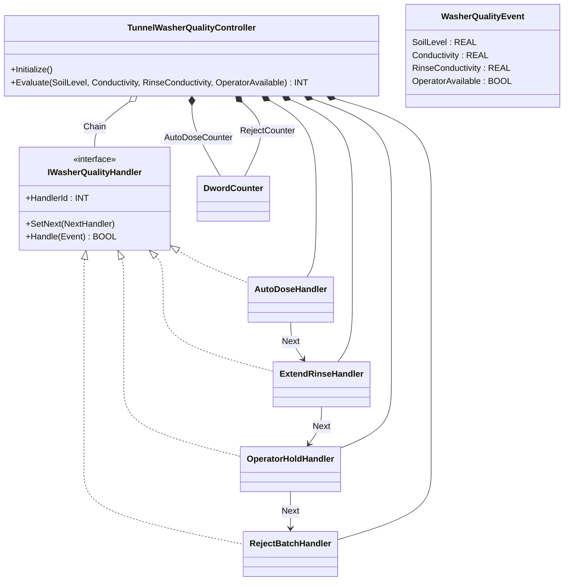
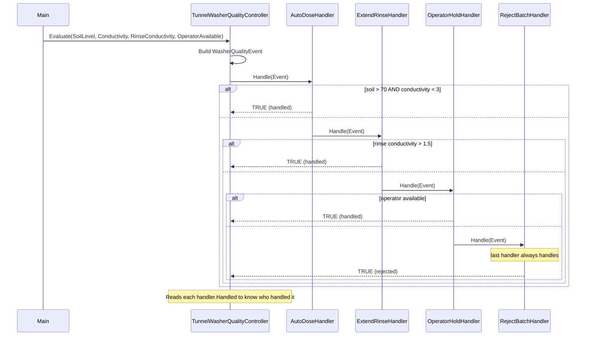

# Tunnel Washer / Industrial Laundry — Chain of Responsibility

An industrial laundry tunnel washer evaluates each batch's quality
metrics — soil level, wash conductivity, rinse conductivity, operator
availability — and chooses one corrective response: auto-dose more
detergent, extend the rinse, hold for the operator, or reject the batch.
The OOP version models the corrective response as a chain of handlers;
each handler decides whether it can solve the problem or passes the
event to the next handler.

## When classic is the right answer

The procedural version is `non-oop/src/Main.st` (46 lines). Use it when:

- The recovery ladder is fixed and short (the four steps above, in that
  order, never reorganized).
- Escalation rules are simple inequalities you can write inline.
- A single response (e.g., reject every failure) is all the plant
  requires.

The OOP version costs about 5.8× the lines. It earns that cost when the
escalation policy changes between sites or product lines, when handlers
need to be reordered, or when a new corrective action (e.g., UV
disinfection retry) needs to slot in without rewriting the existing
ladder.

## Where classic strains

`ClassicWasherQuality.Evaluate` (lines 12-30 of `non-oop/src/Main.st`)
is a four-arm `IF/ELSIF` ladder: each arm tests its threshold, sets the
handler id, and falls through to the next. Reordering — say, trying
operator hold *before* extend rinse on weekday day-shifts only — means
restructuring the whole chain because the IF/ELSIF order is the
escalation order. Adding a UV-retry step after auto-dose means inserting
a new arm in the middle and double-checking that the next-arm conditions
still make sense in the new context. Two product lines that differ only
in escalation order require duplicating the controller. By the second
escalation policy revision the procedural ladder is the most-edited
block in the project.

## Structure



`DwordCounter` comes from the OSCAT OOP library. Everything else is
defined in this example.

## What happens at runtime



## The keystone

```st
(* Initialize: wire the chain — change order here, not in handlers *)
AutoDose.SetNext(NextHandler := ExtendRinse);
ExtendRinse.SetNext(NextHandler := OperatorHold);
OperatorHold.SetNext(NextHandler := RejectBatch);
Chain := AutoDose;

(* Evaluate: one polymorphic call into the chain head *)
Chain.Handle(Event := Event);

(* Each handler decides whether to handle or pass on *)
IF (Event.SoilLevel > REAL#70.0) AND (Event.Conductivity < REAL#3.0) THEN
    Handle := TRUE;          (* AutoDose handles, chain stops *)
ELSE
    Handle := Next.Handle(Event := Event);   (* delegate downstream *)
END_IF;
```

The escalation order is one wiring statement, not the structure of an
IF/ELSIF ladder. To swap operator-hold ahead of extend-rinse:
`AutoDose.SetNext(NextHandler := OperatorHold);
OperatorHold.SetNext(NextHandler := ExtendRinse);` — three lines, no
handler bodies change. To insert a UV-retry handler: write
`UvRetryHandler IMPLEMENTS IWasherQualityHandler` and splice it in by
calling `AutoDose.SetNext(NextHandler := UvRetry);
UvRetry.SetNext(NextHandler := ExtendRinse);`.

## Patterns used

- [Chain of Responsibility](../../../docs/guides/oop-concepts-in-st.md#chain-of-responsibility)

ST mechanics used:

- [Interface](../../../docs/guides/oop-concepts-in-st.md#interface) and
  [IMPLEMENTS](../../../docs/guides/oop-concepts-in-st.md#implements)
- [Polymorphism](../../../docs/guides/oop-concepts-in-st.md#polymorphism)
- [Composition](../../../docs/guides/oop-concepts-in-st.md#composition)

## What this demo doesn't show

- **Handler-specific side effects.** Each handler's `Handle` body just
  sets a flag and returns `TRUE`. A real `AutoDoseHandler` would issue a
  dose command (e.g., set a `DoseRequest` flag the wash controller acts
  on); a real `OperatorHoldHandler` would queue an HMI message. The
  shape supports it; this demo doesn't exercise it.
- **Per-handler timing.** Handlers in real systems often have timeouts
  (operator hold for max 2 minutes, then escalate). This demo is
  synchronous: every handler decides and returns within the same scan.
- **Site-specific chain reordering.** The `Initialize` method hardcodes
  one chain order. A production version might read the order from
  Configuration.st or io.toml and wire the chain at startup based on
  site config. The library mechanism supports this; the demo doesn't
  show it.
- **Per-batch escalation history.** No record of which handler handled
  which batch — only `LastHandlerId` (last single result) and
  `AutoDoseCount`/`RejectCount` (totals). For a batch-level audit trail
  see `chemical_dosing_command/oop` (Command + audit FIFO).

## When NOT to use this

- One-step escalation: every quality failure always rejects. An `IF` in
  the wash controller is shorter.
- Two handlers in a fixed order with no chance of reordering — write the
  IF/ELSE inline.
- Escalation that depends on global plant state, not on the event being
  handled. Chain of Responsibility expects each handler to decide based
  on the event; if the decision needs cross-cutting data, consider
  Mediator instead.

## Integration map

| Tag | Address | Direction |
| --- | --- | --- |
| `Washer.SoilLevelRaw` | `%IW0` | IN |
| `Washer.ConductivityRaw` | `%IW2` | IN |
| `Washer.OperatorAvailable` | `%IX0.0` | IN |
| `Washer.DosePumpOut` | `%QX0.0` | OUT |
| `Washer.RejectOut` | `%QX0.1` | OUT |

Comms (from `oop/io.toml`): `modbus-rtu` (slave 131 on
`loop://washer-conductivity`, 19200/even), `mqtt` (broker
`127.0.0.1:1883`, topics `laundry/washer/01/cmd` in,
`laundry/washer/01/quality` out).

OPC UA exposed records (from `oop/runtime.toml`, namespace
`urn:trust:examples:tunnel-washer-chain`): `Washer.LastHandlerId`,
`Washer.RejectCount`, `Washer.AutoDoseCount`.

## Run

```bash
trust-runtime test --project examples/OSCAT/tunnel_washer_chain/non-oop
trust-runtime test --project examples/OSCAT/tunnel_washer_chain/oop
```

---

## Folder Layout

This paired example contains:

- `non-oop/` — the classic Structured Text project.
- `oop/` — the OSCAT OOP Structured Text project.

## What This Example Teaches

OOP pattern: Chain of Responsibility. The OOP version moves decisions behind named
function-block instances and an interface contract; the non-oop version
inlines those decisions in procedural ST.

## How The Pair Teaches OOP

The teaching content above walks through the same machine in both
projects: where classic strains, the structural diagram of the OOP
version, the keystone snippet, and the integration map. Run the pair
side-by-side and read `non-oop/src/Main.st` first.
