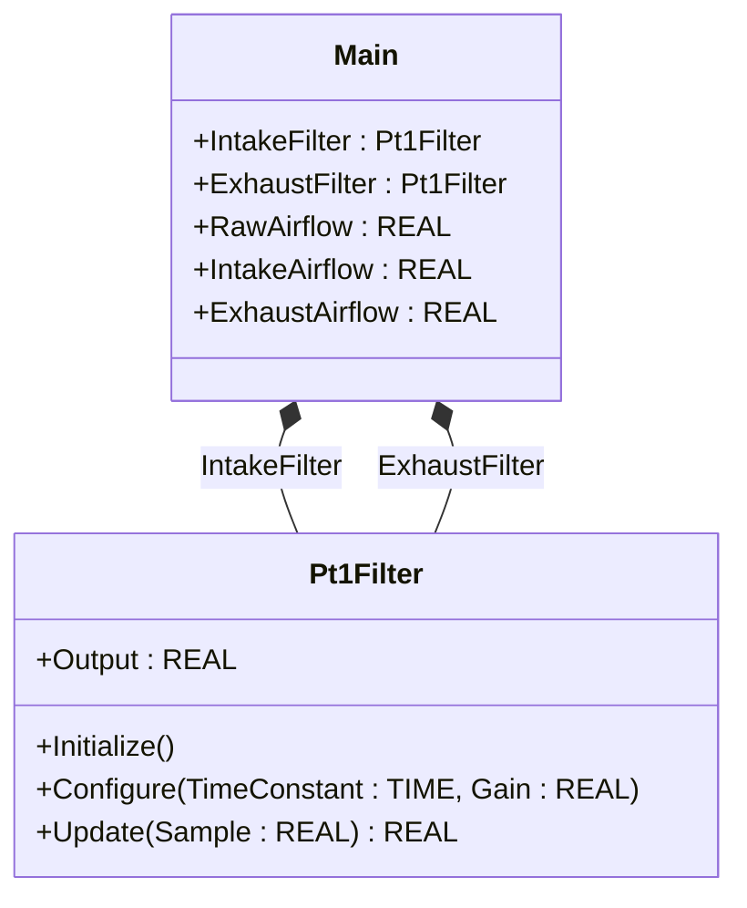
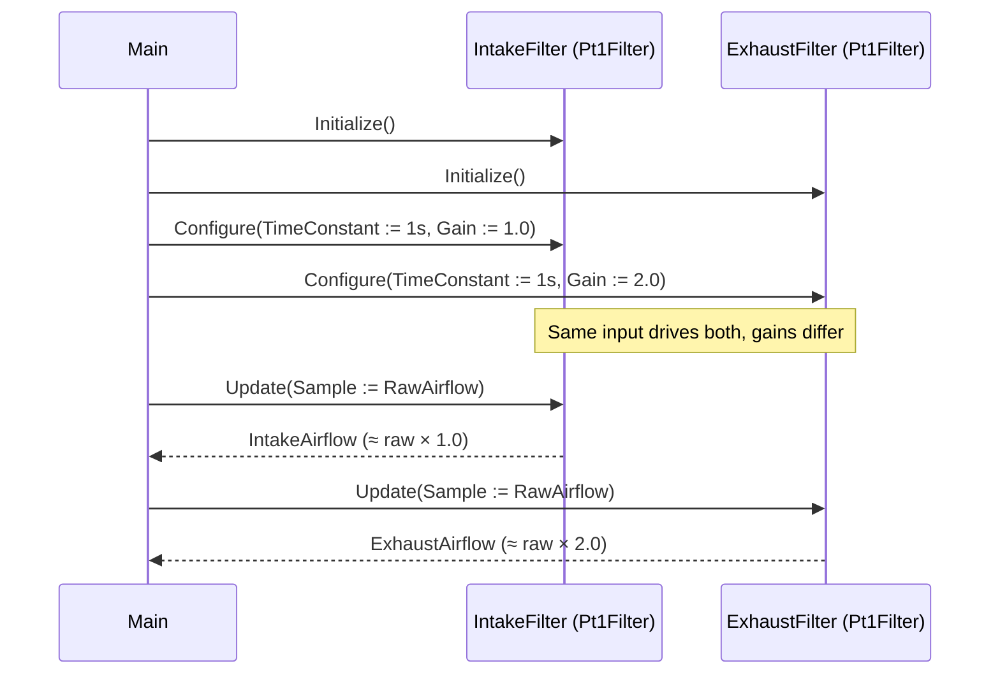

# Ventilation Filter — Showcase

A ventilation system has two airflow signals (intake and exhaust) that
must be smoothed independently. Each filter has its own time constant
and gain, and one channel must never bleed state into the other. This
showcase demonstrates instance isolation by composing two `Pt1Filter`
objects with different tunings driven from the same raw input — and
proves through tests that they keep separate memory.

## When classic is the right answer

The procedural version is `non-oop/src/Main.st` (14 lines). Use it when:

- The plant has only one airflow signal that needs smoothing.
- Both channels need identical filter parameters and you can accept
  the implicit reuse — though even then, two named instances are
  almost always clearer.
- You are inheriting code that already calls `FT_PT1` directly and the
  team has not yet adopted the OOP library.

The OOP version is essentially the same length. It earns its cost
through clarity: named methods (`Initialize`, `Configure`, `Update`)
make the lifecycle explicit, and the `Output` property gives an
identifier to the smoothed value that grep can find.

## Where classic strains

`non-oop/src/Main.st` (14 lines) calls `FT_PT1(in := ..., T := ...,
K := ...)` once per filter and reads `IntakeFilter.out` after. The call
form mixes parameters and configuration in one site, so the time
constant and gain travel inline with every scan call. Adding a third
channel duplicates the call form. Configuring different time constants
per channel happens at the call site rather than at a named
configuration step. Reading the smoothed value uses `.out` on every
classic FB whether the field name still applies or not — there is no
named lifecycle.

## Structure



`Pt1Filter` comes from the OSCAT OOP library. This example defines no
FBs of its own — it shows two named instances with different tunings
driven from one shared input.

## What happens at runtime



## The keystone

```st
(* Two filters, same input, different gains — independent state. *)
IntakeFilter.Initialize();
ExhaustFilter.Initialize();
IntakeFilter.Configure(TimeConstant := T#1s, Gain := REAL#1.0);
ExhaustFilter.Configure(TimeConstant := T#1s, Gain := REAL#2.0);
IntakeAirflow := IntakeFilter.Update(Sample := RawAirflow);
ExhaustAirflow := ExhaustFilter.Update(Sample := RawAirflow);
```

The two `Configure` calls give each filter its own tuning. The two
`Update` calls maintain separate filter memory — proving in tests that
`IntakeFilter.Output` after one update never echoes into
`ExhaustFilter.Output`. Adding a third channel is a third instance
plus a third `Update` line.

## Patterns used

- [Composition (the underlying mechanism)](../../../docs/guides/oop-concepts-in-st.md#composition)

ST mechanics used:

- [Composition](../../../docs/guides/oop-concepts-in-st.md#composition)

## What this demo doesn't show

- **Pressure drop alarms.** Real ventilation filters have ΔP sensors
  and a clog alarm. This showcase only smooths flow signals.
- **Filter health and replacement counter.** Production lines track
  filter age in hours and trigger maintenance flags. None of that is
  modelled.
- **Cascaded filters.** One smoothing stage is shown; cascade or
  multi-pole filters that real instrumentation uses are out of scope.
- **Modbus or MQTT exposure.** The showcase wires no IO drivers; the
  filtered outputs are local variables only.

## Why this is a showcase, not a real machine

The compact showcase is intentionally minimal. There is no clog alarm,
no maintenance counter, no second supervisor that arbitrates the two
flows. Process values are local literals so the ST tests exercise the
two-instance independence claim without external devices.

For composition combined with patterns inside a real-world plant, see
`hvac_air_handling_unit/oop` (Strategy with three filters per mode) or
`tunnel_oven_strategy_observer/oop` (one Pt1Filter per profile).

## When NOT to use this

- A single-channel airflow project: one filter is one filter.
- Plant code that already commits to classic `FT_PT1` calls and would
  pay a rewrite cost to adopt the OOP form for one signal.
- A scan body so simple that the named lifecycle is a tax.

## Run

```bash
trust-runtime test --project examples/OSCAT/ventilation_filter/non-oop
trust-runtime test --project examples/OSCAT/ventilation_filter/oop
```

---

## Folder Layout

This paired example contains:

- `non-oop/` — the classic Structured Text project.
- `oop/` — the OSCAT OOP Structured Text project.

## What This Example Teaches

OOP pattern: Composition (compact showcase). The OOP version moves the
filter lifecycle behind named function-block instances with
`Initialize`, `Configure`, `Update`, and `Output`; the non-oop version
calls `FT_PT1` directly with parameters inlined per call.

## How The Pair Teaches OOP

The teaching content above walks through the same machine in both
projects: where classic strains, the structural diagram of the OOP
version, the keystone snippet, and the call sequence. Run the pair
side-by-side and read `non-oop/src/Main.st` first.
