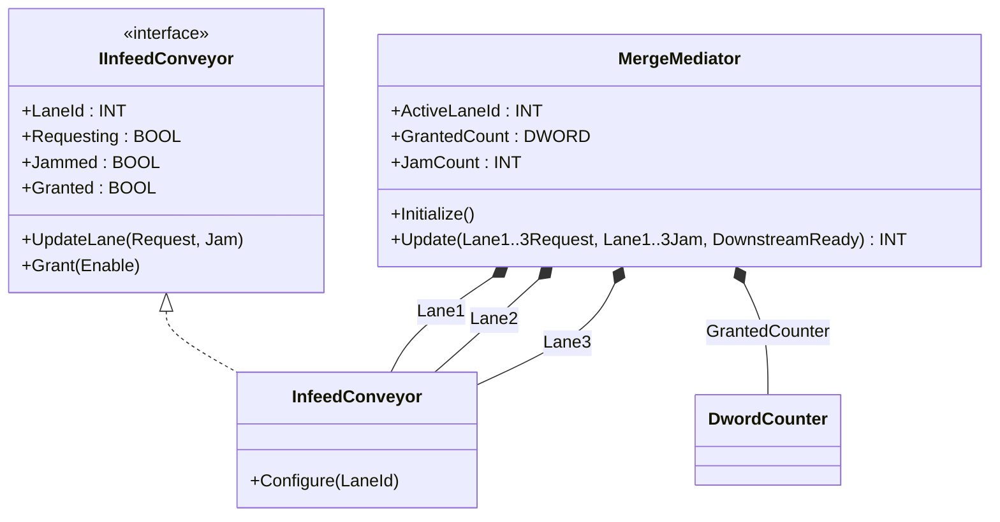
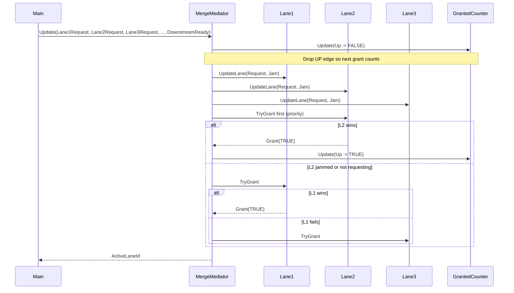

# Warehouse Conveyor Merge — Mediator

Three infeed conveyors meet at one shared merge point. Only one lane
can hand a parcel off at a time, so the merge controller must arbitrate
between the lanes: lane 2 has priority, but a jammed lane is skipped
and a downstream-not-ready signal blocks all grants. The OOP version
makes each lane a named object behind one interface and lets the
`MergeMediator` coordinate them — adding lane 4 is one new instance
plus one new arbitration call, not a fourth `ELSIF`.

## When classic is the right answer

The procedural version is `non-oop/src/Main.st` (42 lines). Use it when:

- The merge has exactly two or three lanes and that count is fixed.
- Priority order is hard-coded forever (no dynamic priority by SKU,
  no time-of-day shift).
- There is no per-lane jam counter, no per-lane request statistics,
  and no per-lane reset path.

The OOP version costs about 4× the lines. It earns that cost when more
lanes get added (each lane is a new instance, not a new branch), when
per-lane state grows (jam counters, request rates, lane-specific reset
behaviour), or when the priority rule starts depending on the lane
themselves rather than the merge body.

## Where classic strains

`ClassicMerge.Update` (lines 6-29 of `non-oop/src/Main.st`) inlines
three almost-identical branches: each lane has its own `IF
LaneNJam THEN JamCountValue := JamCountValue + 1; END_IF` and its own
`ELSIF DownstreamReady AND LaneNRequest AND NOT LaneNJam THEN`
arbitration arm. Adding a fourth lane is a copy-paste of all three
fragments. Adding a per-lane `Granted` output that latches between
scans means six new state flags wired into every branch. Changing the
priority rule means hand-editing the `IF/ELSIF` chain order and double-
checking that the dropped grant case still falls through correctly.

## Structure



`DwordCounter` comes from the OSCAT OOP library. `IInfeedConveyor`,
`InfeedConveyor`, and `MergeMediator` are defined in this example.

## What happens at runtime



## The keystone

```st
(* MergeMediator.Update — owns priority and downstream gating *)
ActiveLaneIdValue := INT#0;
JamCountValue := INT#0;
GrantedCounter.Update(Up := FALSE, Down := FALSE);  (* drop UP edge *)
Lane1.UpdateLane(Request := Lane1Request, Jam := Lane1Jam);
Lane2.UpdateLane(Request := Lane2Request, Jam := Lane2Jam);
Lane3.UpdateLane(Request := Lane3Request, Jam := Lane3Jam);
TryGrant(Lane := Lane2, DownstreamReady := DownstreamReady);  (* priority *)
TryGrant(Lane := Lane1, DownstreamReady := DownstreamReady);
TryGrant(Lane := Lane3, DownstreamReady := DownstreamReady);
```

`TryGrant` is one private method that takes any `IInfeedConveyor`. It
checks the lane is requesting, not jammed, downstream is ready, and no
other lane has been granted yet. Adding a fourth lane is one new
instance and one new `TryGrant` call. The `DwordCounter` UP edge has
to be dropped each scan so consecutive grants emit fresh rising edges.

## Patterns used

- [Mediator](../../../docs/guides/oop-concepts-in-st.md#mediator)

ST mechanics used:

- [Interface](../../../docs/guides/oop-concepts-in-st.md#interface) and
  [IMPLEMENTS](../../../docs/guides/oop-concepts-in-st.md#implements)
- [Polymorphism](../../../docs/guides/oop-concepts-in-st.md#polymorphism)
- [Composition](../../../docs/guides/oop-concepts-in-st.md#composition)

## What this demo doesn't show

- **Sliding-window throughput.** A real WMS tracks parcels per minute
  per lane and rebalances priority dynamically. This demo uses a fixed
  priority of lane 2 first.
- **Jam recovery sequence.** Jams are counted but not resolved; a real
  controller would drive a reverse-and-clear cycle on the jammed lane.
- **Pickup commit.** The `Granted` flag latches inside the lane FB but
  there is no PLC-side commit handshake to the parcel.
- **Multi-merge interlocks.** Real warehouses have several merges
  feeding one main belt; this demo handles a single merge node only.

## When NOT to use this

- A two-lane merge with no growth path: a single `IF` is shorter.
- Strict round-robin with no jam handling: a counter modulo number of
  lanes is shorter than the mediator pattern.
- Static priority that never changes and no per-lane statistics — the
  procedural version is fine.

## Integration map

| Tag | Address | Direction |
| --- | --- | --- |
| `Merge.Lane1Request` | `%IX0.0` | IN |
| `Merge.Lane2Request` | `%IX0.1` | IN |
| `Merge.Lane3Request` | `%IX0.2` | IN |
| `Merge.DownstreamReady` | `%IX0.3` | IN |
| `Merge.Lane1GrantOut` | `%QX0.0` | OUT |
| `Merge.Lane2GrantOut` | `%QX0.1` | OUT |
| `Merge.Lane3GrantOut` | `%QX0.2` | OUT |

Comms (from `oop/io.toml`): `modbus-tcp` (unit 150 on `127.0.0.1:1510`),
`mqtt` (broker `127.0.0.1:1883`, topics `warehouse/merge/cmd` in,
`warehouse/merge/event` out).

OPC UA exposed records (from `oop/runtime.toml`, namespace
`urn:trust:examples:warehouse-conveyor-merge`): `Merge.ActiveLaneId`,
`Merge.GrantedCount`, `Merge.JamCount`.

## Run

```bash
trust-runtime test --project examples/OSCAT/warehouse_conveyor_merge_mediator/non-oop
trust-runtime test --project examples/OSCAT/warehouse_conveyor_merge_mediator/oop
```

---

## Folder Layout

This paired example contains:

- `non-oop/` — the classic Structured Text project.
- `oop/` — the OSCAT OOP Structured Text project.

## What This Example Teaches

OOP pattern: Mediator. The OOP version moves arbitration into a named
mediator object that talks to lanes through an interface; the non-oop
version inlines per-lane branches directly in the merge body.

## How The Pair Teaches OOP

The teaching content above walks through the same machine in both
projects: where classic strains, the structural diagram of the OOP
version, the keystone snippet, and the integration map. Run the pair
side-by-side and read `non-oop/src/Main.st` first.
