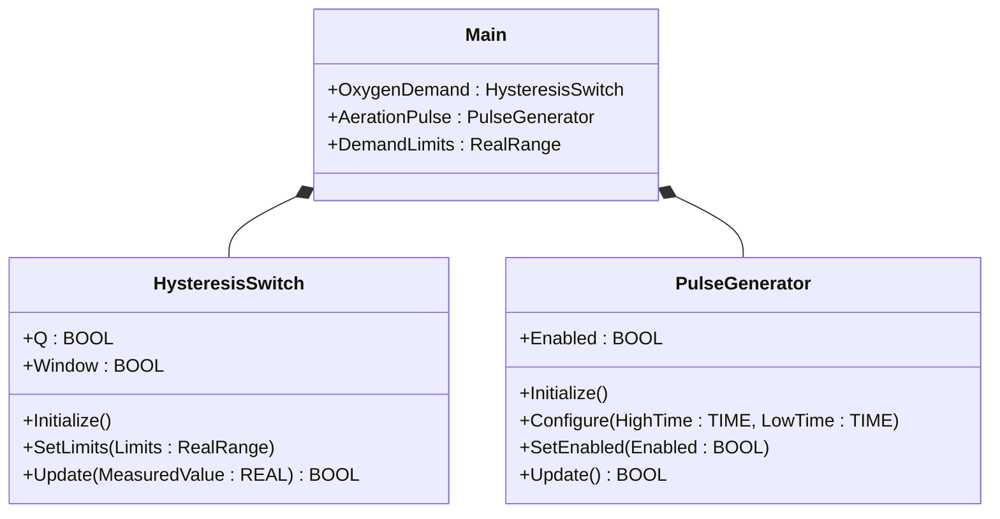
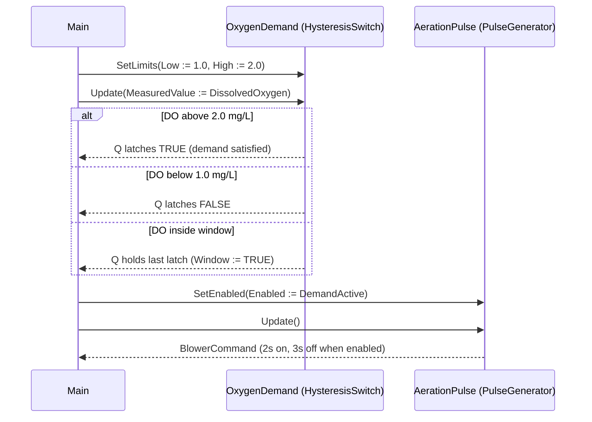

# Wastewater Aeration — Showcase

A wastewater treatment plant runs aeration blowers on a duty cycle.
Dissolved-oxygen demand drives a hysteresis decision (rise above 2.0
mg/L means demand is satisfied; drop below 1.0 mg/L means demand is
real). When demand is real the blower runs on a 2 s on / 3 s off pulse.
This compact showcase composes `HysteresisSwitch` and `PulseGenerator`
from the OSCAT OOP library — no custom function blocks of its own,
just the call sequence the ST tests verify.

## When classic is the right answer

The procedural version is `non-oop/src/Main.st` (12 lines). Use it when:

- The plant has one tank and the duty cycle is fixed.
- Aeration policy is "always on while running" — the pulse stage is
  unnecessary.
- The hysteresis band is built into the field instrument; the PLC
  consumes a digital demand input directly.

The OOP version uses the OSCAT library FBs without adding custom types
of its own. It earns its cost on the first reuse — when a second basin
needs the same demand-then-pulse pattern, you instantiate two of each
FB rather than copy the call form.

## Where classic strains

`non-oop/src/Main.st` (12 lines) calls `HYST` and `GEN_PULSE` once each
inline with their parameters. The hysteresis limits and the pulse high
and low times sit in the same call body as the data flow. Adding a
second basin means copying the entire body. Tuning the hysteresis
window per basin happens inline at every call site, mixing limit
configuration with the per-scan update. By the third basin the pulse
chain is the longest body in the program and every retune touches three
near-identical call lines.

## Structure



`HysteresisSwitch`, `PulseGenerator`, and `RealRange` come from the
OSCAT OOP library. This example defines no FBs of its own — it shows
the call sequence and how the two FBs compose.

## What happens at runtime



## The keystone

```st
(* Demand decision first, then duty-cycle the actuator. *)
DemandLimits.Low := REAL#1.0;
DemandLimits.High := REAL#2.0;
OxygenDemand.SetLimits(Limits := DemandLimits);
DemandActive := OxygenDemand.Update(MeasuredValue := DissolvedOxygen);
AerationPulse.Configure(HighTime := T#2s, LowTime := T#3s);
AerationPulse.SetEnabled(Enabled := DemandActive);
BlowerCommand := AerationPulse.Update();
```

`HysteresisSwitch.Update` returns the latched `Q` of a deadband — TRUE
only after the high limit is crossed, then held until the low limit is
crossed. `PulseGenerator.SetEnabled` gates the duty cycle without
resetting it, so the pulse schedule survives short demand drop-outs.

## Patterns used

- [Composition (the underlying mechanism)](../../../docs/guides/oop-concepts-in-st.md#composition)

ST mechanics used:

- [Composition](../../../docs/guides/oop-concepts-in-st.md#composition)

## What this demo doesn't show

- **Cascaded basins.** A real plant has 3-6 aeration tanks running on
  staggered duty cycles. This showcase has one DO sample.
- **Energy budgeting.** Aeration is a major plant load; production
  controllers cap blower runtime per hour. None of that here.
- **Sensor health.** The DO probe should publish a quality bit; this
  showcase consumes the raw REAL.
- **Manual override.** Operations staff often force blower on for
  visual checks; the showcase has no manual gate.

## Why this is a showcase, not a real machine

The compact showcase is intentionally minimal. There is no second
basin, no energy cap, no sensor-quality input, no manual override.
Process values are local literals so the ST tests exercise the
hysteresis + pulse chain without external devices.

For composition combined with patterns inside a real-world plant, see
`hvac_air_handling_unit/oop` (Strategy with deadband-per-mode) or
`cold_storage_plant/oop` (multi-room hysteresis-driven trees).

## When NOT to use this

- A continuous-running blower with no duty cycle: the pulse stage
  buys nothing.
- A demand input that is already a digital field signal — the
  hysteresis stage is already done in the instrument.
- A plant with one tank and one fixed schedule that has not changed in
  years.

## Run

```bash
trust-runtime test --project examples/OSCAT/wastewater_aeration/non-oop
trust-runtime test --project examples/OSCAT/wastewater_aeration/oop
```

---

## Folder Layout

This paired example contains:

- `non-oop/` — the classic Structured Text project.
- `oop/` — the OSCAT OOP Structured Text project.

## What This Example Teaches

OOP pattern: Composition (compact showcase). The OOP version moves the
hysteresis decision and the pulse duty cycle behind named function-
block instances with explicit `SetLimits`, `SetEnabled`, and `Update`
calls; the non-oop version inlines `HYST` and `GEN_PULSE` parameters
at the call site.

## How The Pair Teaches OOP

The teaching content above walks through the same machine in both
projects: where classic strains, the structural diagram of the OOP
version, the keystone snippet, and the call sequence. Run the pair
side-by-side and read `non-oop/src/Main.st` first.
