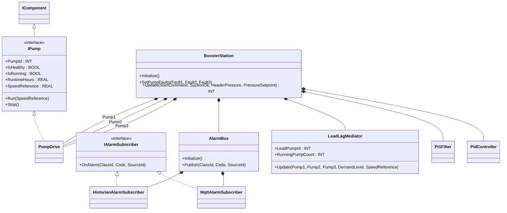

# Water Booster Pump Station — Mediator + Observer

A district water-supply station runs three booster pumps in lead-lag-
standby with a header-pressure setpoint, a dry-run permissive on the
suction side, and an alarm bus that fans events out to a historian
sink and an MQTT publisher. The OOP version models pump arbitration as
a `LeadLagMediator` (lowest-runtime healthy pump wins lead, demand
level dictates how many lag pumps run) and the alarm fan-out as a bus
plus subscribers.

## When classic is the right answer

The procedural version is `non-oop/src/Main.st` (78 lines). Use it when:

- Single pump or fixed lead/lag with two pumps that never grows.
- Single alarm sink (PLC tag the SCADA polls directly).
- Runtime equalization is not required because the pumps are not
  identical or runtime hours are recorded outside the PLC.

The OOP version costs about 6× the lines. It earns that cost when the
station has 3+ pumps with runtime equalization, multiple alarm
consumers (historian + MQTT + HMI banner), and pumps that can be
swapped without recoding the arbitration logic.

## Where classic strains

`BoosterStationClassic.Update` (lines 12-45 of `non-oop/src/Main.st`)
inlines three near-identical lead-selection arms over `Pump1Runtime`,
`Pump2Runtime`, and `Pump3Runtime`. Each arm replicates the runtime-
comparison chain. Adding a fourth pump means writing a fourth arm
that compares against three others. The classic version cannot
arbitrate lag pumps either — it only picks one lead and a fault-only
alarm count, with no demand-level branching for double-pump operation.
The alarm sink is one local counter: adding a second alarm consumer
(MQTT publisher) means widening every alarm-raising branch with a
second flag.

## Structure



`Pt1Filter`, `PidController`, `OntimeMeter`, `DwordFifo32`, and the
`IComponent` lifecycle contract come from the OSCAT OOP library. The
two interfaces, three subscriber FBs, the bus, the mediator, and
`BoosterStation` are defined in this example.

## What happens at runtime

```mermaid
sequenceDiagram
    participant Main
    participant Stn as BoosterStation
    participant M as LeadLagMediator
    participant Bus as AlarmBus
    participant H as Historian
    participant Q as Mqtt

    Main->>Stn: Update(StartCommand, SuctionOk, HeaderPressure, PressureSetpoint)
    alt NOT SuctionOk
        Stn->>Stn: Stop all pumps; LeadPumpId := 0; RunningPumpCount := 0
        Stn->>Bus: Publish(class:=1, code:=0xA201, src:=0)
        Bus->>H: OnAlarm(...)
        Bus->>Q: OnAlarm(...)
    else StartCommand
        Stn->>Stn: filter pressure -> PID -> SpeedReference
        Stn->>M: Update(Pump1, Pump2, Pump3, DemandLevel, SpeedReference)
        M-->>Stn: LeadPumpId, RunningPumpCount
        opt LeadPumpId = 0 (no healthy pump)
            Stn->>Bus: Publish(class:=1, code:=0xA202, src:=0)
        end
    else NOT StartCommand
        Stn->>Stn: Stop all pumps; RunningPumpCount := 0
    end
```

## The keystone

```st
(* Suction loss latches lead/running state to zero — pumps are
   commanded stopped, count must reflect that. *)
IF NOT SuctionOk THEN
    AlarmBusValue.Publish(ClassId := BYTE#1, Code := DWORD#16#A201,
        SourceId := INT#0);
    Pump1.Stop(); Pump2.Stop(); Pump3.Stop();
    RunningPumpCountValue := INT#0;
    LeadPumpIdValue := INT#0;
ELSIF StartCommand THEN
    FilteredPressure := PressureFilter.Update(Sample := HeaderPressure);
    CommandValue := Controller.Update(Actual := FilteredPressure,
        Target := PressureSetpoint);
    Mediator.Update(Pump1 := Pump1, Pump2 := Pump2, Pump3 := Pump3,
        DemandLevel := DemandLevel, SpeedReference := CommandValue);
END_IF;
```

A new pump is one new `PumpDrive` instance and one extra mediator
input. A new alarm subscriber is one new field on `AlarmBus` plus one
extra `OnAlarm` invocation inside `Publish` — no station logic changes.
The mediator picks the lowest-runtime healthy pump, then optionally
runs an extra lag pump when `DemandLevel >= 2`.

## Patterns used

- [Mediator](../../../docs/guides/oop-concepts-in-st.md#mediator)
- [Observer](../../../docs/guides/oop-concepts-in-st.md#observer)

ST mechanics used:

- [Interface](../../../docs/guides/oop-concepts-in-st.md#interface) and
  [IMPLEMENTS](../../../docs/guides/oop-concepts-in-st.md#implements)
- [Polymorphism](../../../docs/guides/oop-concepts-in-st.md#polymorphism)
- [Composition](../../../docs/guides/oop-concepts-in-st.md#composition)

## What this demo doesn't show

- **VFD-aware load sharing.** The mediator picks the pump but does not
  ramp speed across pumps for hydraulic balance. Production stations
  share load to keep efficiency curves on plate.
- **Anti-cycling timers.** Real pumps must run for a minimum time
  after starting; this demo allows immediate stop.
- **Cavitation / suction-pressure ramp.** Suction is one boolean.
  Production reads suction pressure and ramps the lead pump speed to
  protect the pump.
- **Alarm acknowledgement / latching.** All alarms fan out, but the
  bus has no acknowledgement protocol back from the historian.
- **Wear-leveling beyond runtime hours.** The mediator weighs only by
  hours; production also weighs by start counts and last-maintenance
  timestamps.

## When NOT to use this

- Single pump, single alarm sink — direct `Pump.Run` is shorter.
- Pumps are identical and runtime equalization is not a requirement
  (the mediator buys nothing without runtime hours to weigh).
- The vendor BMS owns lead/lag arbitration — this would duplicate it.

## Integration map

| Tag | Address | Direction |
| --- | --- | --- |
| `Station.StartCommand` | `%IX0.0` | IN |
| `Station.SuctionOk` | `%IX0.1` | IN |
| `Station.Pump1Fault` | `%IX0.2` | IN |
| `Station.Pump2Fault` | `%IX0.3` | IN |
| `Station.Pump3Fault` | `%IX0.4` | IN |
| `Station.HeaderPressureRaw` | `%IW0` | IN |
| `Station.Pump1Enable` | `%QX0.0` | OUT |
| `Station.Pump2Enable` | `%QX0.1` | OUT |
| `Station.Pump3Enable` | `%QX0.2` | OUT |
| `Station.AlarmOut` | `%QX0.3` | OUT |

Comms (from `oop/io.toml`): `modbus-tcp` (unit 3 on `127.0.0.1:1504`),
`mqtt` (broker `127.0.0.1:1883`, topics `water/booster/station_03/cmd`
in, `water/booster/station_03/event` out). Safe-state forces
`Station.Pump1Enable := FALSE` on driver fault.

OPC UA exposed records (from `oop/runtime.toml`, namespace
`urn:trust:examples:water-booster`): `Station.LeadPumpId`,
`Station.RunningPumpCount`, `Station.AlarmActive`.

## Run

```bash
trust-runtime test --project examples/OSCAT/water_booster_pump_station/non-oop
trust-runtime test --project examples/OSCAT/water_booster_pump_station/oop
```

---

## Folder Layout

This paired example contains:

- `non-oop/` — the classic Structured Text project.
- `oop/` — the OSCAT OOP Structured Text project.

## What This Example Teaches

OOP pattern: Mediator + Observer. The OOP version moves arbitration
into a named mediator that talks to pumps through one interface, and
fans alarms through a bus to multiple subscriber sinks; the non-oop
version inlines pump-by-pump runtime comparison and a single alarm
counter.

## How The Pair Teaches OOP

The teaching content above walks through the same machine in both
projects: where classic strains, the structural diagram of the OOP
version, the keystone snippet, and the integration map. Run the pair
side-by-side and read `non-oop/src/Main.st` first.
