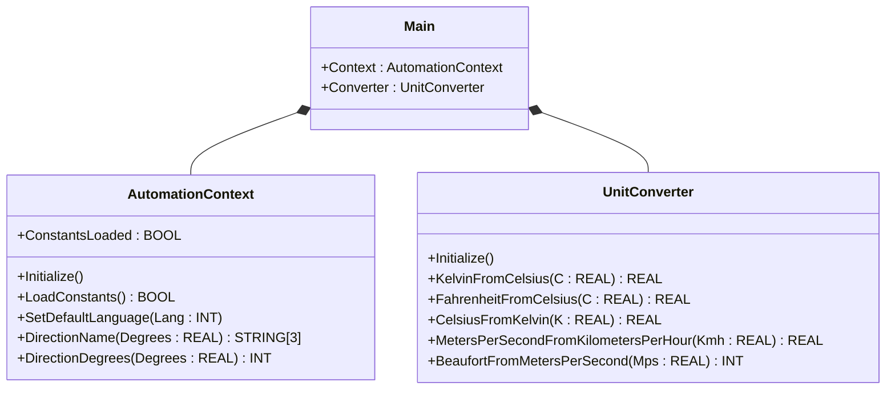
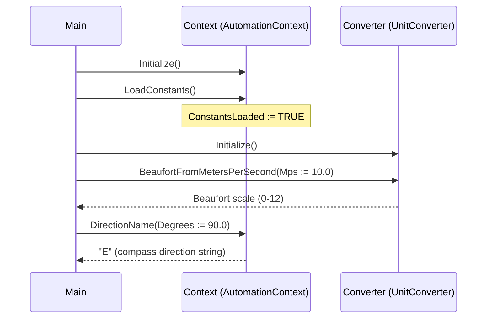

# Weather Station Conversion — Showcase

A weather station produces telemetry that needs OSCAT scientific
constants, compass-direction lookup, and wind-speed conversion (m/s
to Beaufort). The OOP version groups constants and direction helpers
behind one `AutomationContext` service object and conversion math
behind one `UnitConverter` service. Both are stateless services with
named lifecycle methods, so a future grow path (more conversions, a
language switch on direction names) does not litter the scan body.

## When classic is the right answer

The procedural version is `non-oop/src/Main.st` (13 lines). Use it when:

- The station does one or two fixed conversions and the call sites
  are scattered already — wrapping them in a service object is more
  ceremony than the program needs.
- No future plan to localize direction names or to add more units
  (kPa, hPa, knots).
- The classic OSCAT helpers (`MS_TO_BFT`, `DEG_TO_DIR`,
  `OSCAT_BASIC_Constants`) are already used elsewhere in the project
  and consistency matters.

The OOP version is the same length but earns its keep when conversion
calls multiply: every conversion stays behind a method on a named
service rather than as a free-standing helper invocation.

## Where classic strains

`non-oop/src/Main.st` (13 lines) calls `OSCAT_BASIC_Constants()`,
`MS_TO_BFT(...)`, and `DEG_TO_DIR(...)` as free-standing functions.
There is no service handle; every caller depends on the global helper
namespace. Adding a `BFT_TO_MS` reverse function spreads more free
functions across the project. Switching the direction string language
from English to German requires editing every `DEG_TO_DIR` call site
to add a language argument — there is no service-level configuration
step.

## Structure



`AutomationContext` and `UnitConverter` come from the OSCAT OOP
library. This example defines no FBs of its own — it shows the call
sequence and how the two services compose.

## What happens at runtime



## The keystone

```st
(* Two stateless service objects share the conversion surface. *)
Context.Initialize();
Context.LoadConstants();
Converter.Initialize();
BeaufortIndex := Converter.BeaufortFromMetersPerSecond(Mps := WindMetersPerSecond);
WindDirection := Context.DirectionName(Degrees := REAL#90.0);
```

`AutomationContext` exposes constants (`Math`, `Phys`) and direction
helpers under one namespace. `UnitConverter` exposes a stable
conversion surface (m/s → Beaufort, °C → K, kWh → J, etc.). Each new
conversion is a new method on the converter; each language is one
`SetDefaultLanguage` call followed by `DirectionName` lookups against
the active table. The classic helpers stay underneath as the
implementation backing.

## Patterns used

- [Composition (the underlying mechanism)](../../../docs/guides/oop-concepts-in-st.md#composition)

ST mechanics used:

- [Composition](../../../docs/guides/oop-concepts-in-st.md#composition)

## What this demo doesn't show

- **Language switching.** `AutomationContext.SetDefaultLanguage`
  exists in the library but the showcase calls only English direction
  names. Real telemetry feeds would set language from a configuration
  channel.
- **Sensor-quality propagation.** Each helper returns a clean value;
  no quality bit is carried forward when the source reading is stale.
- **Unit ambiguity reporting.** Beaufort scale clamps at 12 silently;
  production telemetry would log a "wind exceeds scale" event.
- **Multi-station fan-out.** One context instance is shown; cluster
  weather networks would have one context per station with shared
  constants.

## Why this is a showcase, not a real machine

The compact showcase is intentionally minimal. There is no language
switch, no sensor-quality propagation, no over-scale logging, no
multi-station fan-out. Process values are local literals so the ST
tests exercise the conversion services without external feeds.

For composition combined with patterns inside a real-world plant, see
`weather_protected_facade/oop` (lookup tables behind a Facade) or
`hvac_air_handling_unit/oop` (Strategy with per-mode constant
lookups).

## When NOT to use this

- A station that calls one helper one time and exposes the result —
  the service object is more ceremony than benefit.
- Code that already commits to classic OSCAT free functions and would
  pay a rewrite cost to adopt the OOP services.
- A scan body that already has every conversion inlined and the team
  has not asked for refactoring.

## Run

```bash
trust-runtime test --project examples/OSCAT/weather_station_conversion/non-oop
trust-runtime test --project examples/OSCAT/weather_station_conversion/oop
```

---

## Folder Layout

This paired example contains:

- `non-oop/` — the classic Structured Text project.
- `oop/` — the OSCAT OOP Structured Text project.

## What This Example Teaches

OOP pattern: Composition (compact showcase). The OOP version moves
constants, direction helpers, and unit conversion behind named
service objects with explicit `Initialize`, `LoadConstants`, and
named conversion methods; the non-oop version calls
`OSCAT_BASIC_Constants`, `MS_TO_BFT`, and `DEG_TO_DIR` as free-
standing helpers.

## How The Pair Teaches OOP

The teaching content above walks through the same machine in both
projects: where classic strains, the structural diagram of the OOP
version, the keystone snippet, and the call sequence. Run the pair
side-by-side and read `non-oop/src/Main.st` first.
