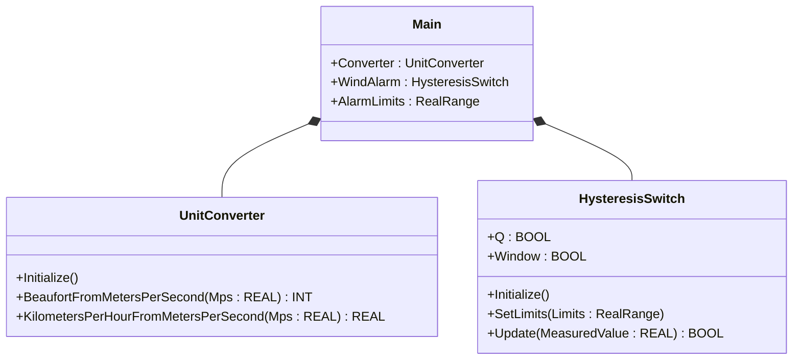
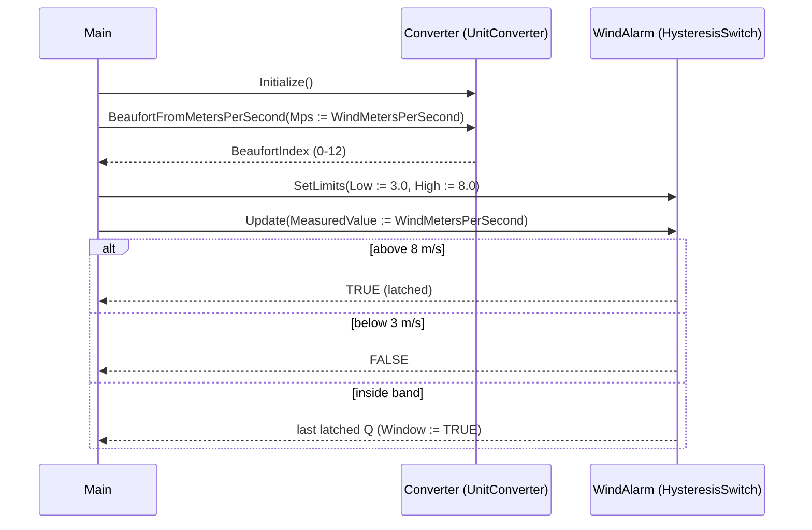

# Wind Speed Alarm — Showcase

A wind-speed warning system has a simple shape: read m/s, normalize to
a Beaufort index, and trip a hysteresis alarm when the wind crosses
the high band. The OOP version composes `UnitConverter` (to expose
the Beaufort number to telemetry) and `HysteresisSwitch` (to latch the
alarm) so the conversion stays at the input edge and the alarm stays
in its own object — neither leaks into the other.

## When classic is the right answer

The procedural version is `non-oop/src/Main.st` (12 lines). Use it when:

- The sensor already publishes the right unit (no conversion needed).
- The alarm threshold is fixed and the deadband never widens.
- The plant has one mast and no plan to add more wind sensors.

The OOP version is essentially the same length. It earns its cost
through clarity: the converter and the alarm are independent service
and component objects with named lifecycle, so adding a second mast
is two new instances rather than a duplicated call body.

## Where classic strains

`non-oop/src/Main.st` (12 lines) calls `MS_TO_BFT` and `HYST(...)`
inline with their parameters. The high and low limits sit at the call
site mixed with the data flow. Adding a second mast means duplicating
the entire body. Tightening the band per mast happens at every call
site. The classic call form has no place for normalization to live as
a separate concern from the alarm decision — both are inline in one
program scan.

## Structure



`UnitConverter`, `HysteresisSwitch`, and `RealRange` come from the
OSCAT OOP library. This example defines no FBs of its own — it shows
the call sequence and how the two service/component objects compose.

## What happens at runtime



## The keystone

```st
(* Converter at the input edge; alarm hysteresis on raw m/s. *)
Converter.Initialize();
BeaufortIndex := Converter.BeaufortFromMetersPerSecond(Mps := WindMetersPerSecond);
AlarmLimits.Low := REAL#3.0;
AlarmLimits.High := REAL#8.0;
WindAlarm.Initialize();
WindAlarm.SetLimits(Limits := AlarmLimits);
AlarmActive := WindAlarm.Update(MeasuredValue := WindMetersPerSecond);
```

`UnitConverter.BeaufortFromMetersPerSecond` is a stateless service
call that produces the operator-readable Beaufort index for HMI use.
`HysteresisSwitch.Update` consumes the raw m/s reading directly so the
alarm decision keeps its own band semantics — separating the two
prevents the all-too-common bug where a unit conversion accidentally
shifts the alarm threshold.

## Patterns used

- [Composition (the underlying mechanism)](../../../docs/guides/oop-concepts-in-st.md#composition)

ST mechanics used:

- [Composition](../../../docs/guides/oop-concepts-in-st.md#composition)

## What this demo doesn't show

- **Multi-band alarms.** Real wind systems alarm at warning, danger,
  and shutdown thresholds. This showcase has one band only.
- **Direction-aware tripping.** Production wind alarms gate on wind
  *direction* (a 25 m/s gust from the east means roof closure; from
  the west may not). No direction here.
- **Smoothed wind for HMI.** Beaufort is computed on the raw sample;
  HMI displays normally show a 10 s mean. The smoothing stage would
  be a `Pt1Filter` between the converter and the alarm.
- **Alarm publishing.** The `AlarmActive` flag is local. Real plants
  push to a `DwordFifo16` (see `boiler_feedwater_alarm` showcase) so
  HMI and historian both pick the event up.

## Why this is a showcase, not a real machine

The compact showcase is intentionally minimal. There is no second
threshold, no direction gate, no wind-mean smoothing, no alarm
publish. Process values are local literals so the ST tests exercise
the converter + hysteresis composition without external devices.

For composition combined with patterns inside a real-world plant, see
`weather_protected_facade/oop` (Facade behind multiple weather
inputs) or `wastewater_aeration/oop` (hysteresis combined with a
`PulseGenerator`).

## When NOT to use this

- One mast with the right unit at the sensor and a fixed threshold —
  a single `IF WindMps > 8.0` is shorter.
- A plant that already exposes a Beaufort signal directly (some
  weather PLCs do) — the converter is then dead weight.
- Vendor BMS that owns the wind alarm — duplicating it on the PLC
  is busywork.

## Run

```bash
trust-runtime test --project examples/OSCAT/wind_speed_alarm/non-oop
trust-runtime test --project examples/OSCAT/wind_speed_alarm/oop
```

---

## Folder Layout

This paired example contains:

- `non-oop/` — the classic Structured Text project.
- `oop/` — the OSCAT OOP Structured Text project.

## What This Example Teaches

OOP pattern: Composition (compact showcase). The OOP version moves the
unit conversion into one service object and the alarm into one
component object with named lifecycle methods; the non-oop version
calls `MS_TO_BFT` and `HYST` inline with parameters mixed into the
data flow.

## How The Pair Teaches OOP

The teaching content above walks through the same machine in both
projects: where classic strains, the structural diagram of the OOP
version, the keystone snippet, and the call sequence. Run the pair
side-by-side and read `non-oop/src/Main.st` first.
